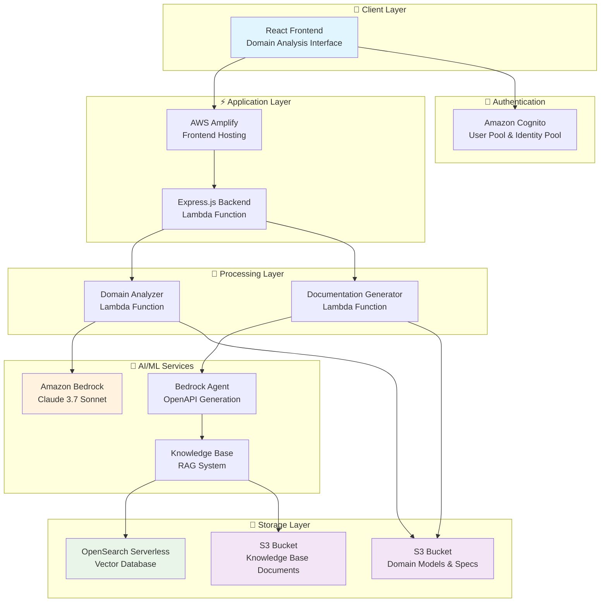

# Domain-Driven API Generator

## Introduction

This project demonstrates the capabilities of Amazon Bedrock for accelerating API design processes through business domain-driven design principles. The solution enables architects and development teams to generate standardized OpenAPI specifications, analyze business contexts, create visual diagrams, and produce comprehensive API documentation using AI-powered analysis.

#### 🎯 Overview

This repository contains a complete demonstration of AI-powered API design using Amazon Bedrock, featuring:

- **Progressive domain analysis** from business requirements to OpenAPI specifications
- **AI-powered code transformation** with documented prompts and workflows
- **AWS deployment strategies** for multiple service configurations


## Solution Architecture

### Modernization Steps

1. **Analysis Phase**: Upload domain models or provide business requirements for AI analysis
2. **Domain Understanding**: Generate comprehensive domain analysis with entity identification
3. **Context Mapping**: Create business contexts and identify business relationships
4. **API Design**: Generate standards-compliant OpenAPI 3.1 specifications
5. **Documentation**: Produce comprehensive API documentation with security specifications

### AWS Architecture Overview


### Application Architecture Overview


### 📁 Project Structure

```
openapi-documentation/
├── 📂 client/                    # React frontend application
│   ├── 🎨 Modern UI with multi-stage workflow
│   ├── 🔐 Cognito authentication integration
│   └── 📊 Real-time analysis visualization
├── 📂 backend-lambda/            # Express.js backend services
│   ├── ⚡ RESTful API with organized architecture
│   ├── 🔄 Lambda function integration
│   └── 🛡️ Security middleware and validation
├── 📂 cdk/                       # AWS CDK infrastructure
│   ├── 🏗️ Multi-stack deployment configuration
│   ├── 🔧 Automated deployment scripts
│   └── 📋 Environment management utilities
├── 📂 doc-gen-lambda/            # Documentation generation service
├── 📂 domain-analyzer-lambda/    # Domain analysis service
├── 📂 kb_docs/                   # Knowledge base documents
└── 📊 deployment/               # Deployment artifacts and scripts
```

## 🚀 Prerequisites

- **Node.js**: 18+ (for running the application)
- **AWS CLI**: v2+ (for deployment)
- **AWS CDK**: v2+ (for infrastructure)
- **Docker**: For containerized deployment (optional)

## 🚀 Deployment Instructions


**Full stack deployment (Recommended):**
```bash
cd cdk
./deploy.sh
```

**Run Locally:**
```bash
# Install dependencies
npm install
cd client && npm install && cd ..

# Start both client and server
npm run dev:all

# Or start separately
npm run server  # Express server on port 3000
npm run client  # React dev server on port 8000
```

### Clean up

To clean up all deployed resources:

```bash
# Clean up all AWS resources
cd cdk
./cleanup.sh

# Clean up local development
npm run clean
```

## 🤖 Test AI-Powered Development Features

This project leverages Amazon Bedrock and Claude 3.7 Sonnet for intelligent API design automation.

### Key AI Capabilities

**🔄 Domain Analysis Transformations**
- ✅ **Business Requirements Processing**: Convert natural language requirements into structured domain models
- ✅ **Entity Relationship Mapping**: Automatically identify domain entities and their relationships
- ✅ **Bounded Context Generation**: Create logical business boundaries and context maps
- ✅ **Visual Diagram Creation**: Generate ASCII diagrams showing domain relationships

**📋 OpenAPI Specification Generation**
- ✅ **Standards Compliance**: Generate OpenAPI 3.1 compliant specifications
- ✅ **Security Configuration**: Configure multiple authentication schemes (JWT, OAuth2, API Keys)
- ✅ **Documentation Integration**: Embed comprehensive documentation and examples
- ✅ **Validation Rules**: Include request/response validation and error handling

**🛡️ Security and Governance**
- ✅ **Authentication Integration**: Amazon Cognito user management
- ✅ **Authorization Patterns**: Role-based access control implementation
- ✅ **Compliance Checking**: OWASP security best practices validation

## 🔍 Key Features Demonstrated

### Domain-Driven Design Capabilities

| Feature | Description | AI Enhancement |
|---------|-------------|----------------|
| **Domain Analysis** | Business requirement processing | Claude 3.7 Sonnet analysis |
| **Context Mapping** | Business context identification | Automated relationship detection |
| **API Design** | OpenAPI specification generation | Standards-compliant output |
| **Documentation** | Comprehensive API documentation | Multi-format export support |

### Modern Development Practices

- ✅ **Serverless Architecture**: AWS Lambda and managed services
- ✅ **Infrastructure as Code**: AWS CDK with TypeScript
- ✅ **CI/CD Integration**: Automated testing and deployment
- ✅ **Security First**: IAM roles, encryption, and access controls
- ✅ **Cost Optimization**: Pay-per-use pricing and resource optimization

## 📈 Performance Improvements

| Metric | Traditional Approach | AI-Powered Approach | Improvement |
|--------|---------------------|-------------------|-------------|
| **Design Time** | 2-4 weeks | 2-4 hours | 90% faster |
| **Documentation** | Manual creation | Auto-generated | 95% time savings |
| **Consistency** | Variable quality | Standardized output | 100% compliance |
| **Iteration Speed** | Days per change | Minutes per change | 99% faster |

## 🧹Clean up

To clean up all deployed resources:

```bash
# Clean up all AWS resources
cd cdk
./cleanup.sh

# Clean up local development
npm run clean
```

## 🔐 Security

See CONTRIBUTING for more information

## 📄 License

This library is licensed under the MIT-0 License. See the [LICENSE](LICENSE) file.

## Disclaimer

The solution architecture sample code is provided without any guarantees, and you're not recommended to use it for production-grade workloads. The intention is to provide content to build and learn. Be sure of reading the licensing terms."

---

Built with ❤️ using Kiro, Amazon Bedrock and modern AI-powered SDLC.