# AWS Architecture-Designer

## Leveraging Amazon Bedrock for Cloud Architecture Design

This pattern demonstrates how to leverage Generative AI to accelerate and optimize cloud architecture design processes. The solution enables architects and development teams to generate standardized architecture patterns, optimize resource configurations, ensure compliance, and create detailed documentation. The implementation utilizes Amazon Bedrock capabilities to access enterprise data, generate recommendations, and automate architecture-related tasks while maintaining security and compliance requirements. This solution uses the following AWS services:

- Amazon Bedrock for AI-powered assistance and automation
- Amazon ECR
- Amazon S3 for data storage
- AWS Lambda
- AWS IAM for security and access control
- Drawio for drawings


The pattern addresses common challenges in cloud architecture design, including:

- Accelerating architecture design processes
- Ensuring compliance with best practices
- Visualisation and guidence of architecture design with Drawio
- Optimizing resource utilization and costs
- Maintaining consistent documentation
- Enabling collaboration across teams


**You can check the demo of this pattern from [Live Demo](http://35.94.27.240:8501/)**


This solution is particularly valuable for organizations seeking to streamline their cloud architecture design process while maintaining high standards of quality and compliance. With the help of this tool you can:

- Generate an AWS architecture Design and drawing by either providing the technical requirements as a text or you can upload a Business Requirement Document by upload function to provide details.
- Generate Cloud formation Template based on the designed architecture
- Upload your architectural drawings and ask the tool for explaning the details of the architecture
- Estimate costs for the proposed architecture.

In the first part we are building Generative AI Agents using Amazon Bedrock Agents.

Over the course of this part, we will construct a Bedrock Agent that can assist with querying the AWS Well-Architected Framework and generating code.


## Prerequisites
This solution assumes you are working in an environment with access to Python 3.9 or later and Docker. AWS Region: us-west-2 selected for the purpose of this solution.

## Setting up your local Environment


**Clone the Repository:** Start by cloning the provided repository which contains the code for our agent.

```bash

git clone https://gitlab.aws.dev:makvac/ai-powered-modern-application-development.git
cd amazon-bedrock-agents-quickstart

```

**Install Dependencies:** Run the appropriate pip install command to download necessary packages.

```bash

pip install -r requirements.txt

```

## Create the IAM roles

1. In your console, go to your [IAM Dashboard](https://us-west-2.console.aws.amazon.com/iam/).
2. Go to Policies in the right-hand side menu.
3. Create one policie named for example Bedrock-InvokeModel-Policy
   ```json
   {
    "Version": "2012-10-17",
    "Statement": [
        {
            "Sid": "VisualEditor0",
            "Effect": "Allow",
            "Action": "bedrock:InvokeModel",
            "Resource": [
                "arn:aws:bedrock:*::foundation-model/*"
                ]
            }
        ]
    }
   ```
  4. Create one policie named for example Bedrock-S3-GetObject

  ```json
   {
    "Version": "2012-10-17",
    "Statement": [
        {
            "Sid": "VisualEditor0",
            "Effect": "Allow",
            "Action": "s3:GetObject",
            "Resource": [
                "arn:aws:s3:::*"
                ]
            }
        ]
    }
   ```

    
  5. Create a role named AmazonBedrockExecutionRoleForAgents and attach the two policies we just created previously. 


  ## Building an Agent

To get started with the agent, open the Bedrock console, select Agents in the left navigation panel, then choose Create Agent.

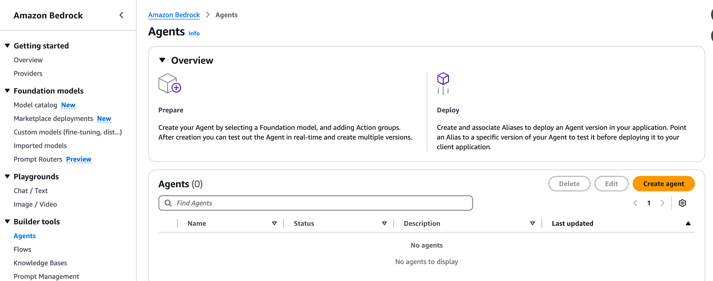


This starts the agent creation workflow.

1. Provide agent details including agent name, description, whether the agent is allowed to request additional user inputs, and choose the IAM role created earlier.

Here is what I used for this Agent
```
Agent-AWS

Agent AWS is an automated, AI-powered agent that helps customers with knowledge of AWS by querying the AWS Well-Architected Framework and writing code.
```
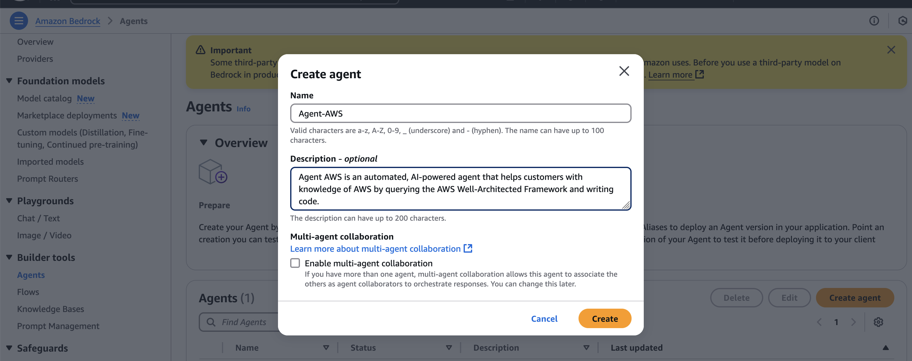


2. Select a foundation model from Bedrock that fits your use case. For this project we selected Antrophic Claude Sonnet v2 but feel free to try other models. Here, you provide an instruction to your agent in natural language. The instruction tells the agent what task it’s supposed to perform and the persona it’s supposed to assume. 
For example, “You are an expert AWS Certified Solutions Architect. Your role is to help customers understand best practices on building on AWS.”


Copy the Agent ID, we need to update our codes by using this Agent ID.

3. Skip the Add Action Groups and create an Agent. 

4. This is where we have to develop "tools" for the agent which are orchestrated through the action groups.

## Building Agent Tools

Tools are self-contained functions designed to perform a specific task. In `tools.py` we have two functions we are going to provide to our agent `aws_well_arch_tool` and `code_gen_tool`.

### Querying the AWS Well-Architected Framework

The code for this tool uses [Langchain](https://python.langchain.com/docs/get_started/introduction.html) a popular framework for developing applications powered by large language models. Langchain provides an interface to use Bedrock Embeddings with a [local vector database](https://github.com/facebookresearch/faiss) to retrieve documents relevant to a user's query. Using the documents, we can then send a request to the Titan model using Bedrock to get a response back with relevant context. this is known as [Retrieval Augmented Generation (RAG)](https://docs.aws.amazon.com/sagemaker/latest/dg/jumpstart-foundation-models-customize-rag.html).

To learn more about how the data was collected and embeddings read this [blog post](https://community.aws/posts/well-arch-chatbot#data-collection)

The code used to collect the data is in `ingest.py`

## Building the Lambda Function

For our Agent to use our tools, we must encapsulate the logic into a lambda function. `index.py` has the logic to parse a request from the agent, and then pick the correct tool to use. The function will then format the response and send it back to the agent.

### Push Docker Image to ECR

We will package this Lambda function as a container, so create a new ECR following these [instructions](https://docs.aws.amazon.com/AmazonECR/latest/userguide/repository-create.html). I called mine `bedrock_sa_tools`

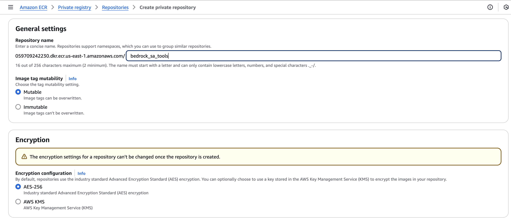

Once the repo is created, follow the instructions in the `View push commands` button to upload the Docker Image to ECR.

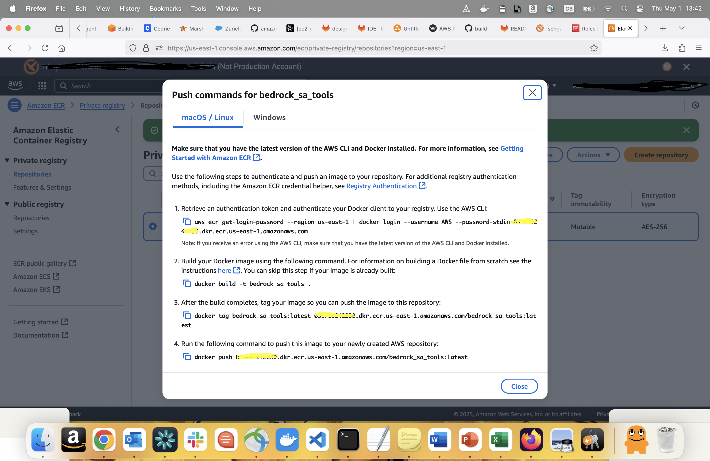

### Create the Lambda Function

1. Navigate to the [Lambda Console](https://us-east-1.console.aws.amazon.com/lambda/home?region=us-west-2#/functions) and click on `Create function` button.

2. Chose Container image then provide the `Function name` (berdock_sa_tools) and for the `Container image URI` select the container you uploaded.

3. Click on Create function button in the bottom of the page 

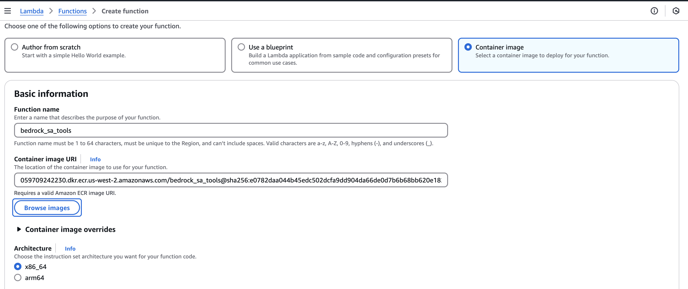

### Update Lambda Permissions

1. Once the function is created, click on the Configuration Tab in the same page and `Choose Permissions` from the left side panel

2. Click on Add permissions button in Resource-based policy statement section to provide the permission to invoke lambda functions from bedrock

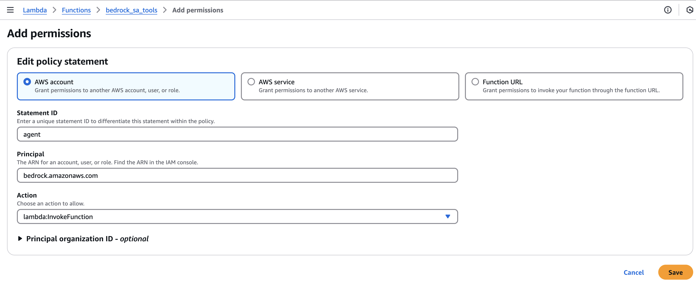

3. Provide Statement Id as `agent` , Principal as `bedrock.amazonaws.com` and Action as `lambda:InvokeFunction`. Click Save after adding all the above three information.


4. Change the lambda settings for the memory and the timeout values:

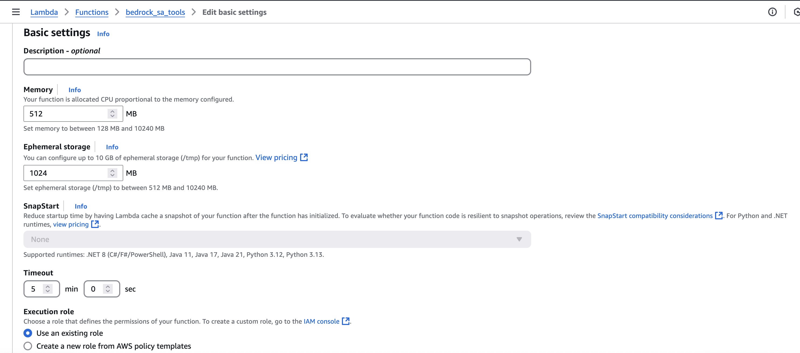

5. Add the following Policy Statement to your Execution role, so Lambda can call Bedrock. (Details [here](https://docs.aws.amazon.com/IAM/latest/UserGuide/access_policies_manage-attach-detach.html#add-policies-console))
```json
{
    "Version": "2012-10-17",
    "Statement": [
        {
            "Sid": "VisualEditor0",
            "Effect": "Allow",
            "Action": "bedrock:InvokeModel",
            "Resource": "*"
        }
    ]
}
```

### Testing Lambda Function

To test your Lambda function:

1. Click on the "Test" tab near the top of the page.

2. Configure a test event that matches how the Agent will send a request:

```
{
  "agent": {
    "alias": "TSTALIASID",
    "name": "Agent-AWS",
    "version": "DRAFT",
    "id": "********" (Copy your Amazon Bedrock Agent Id to here)
  },
  "sessionId": "975786472213626",
  "httpMethod": "GET",
  "sessionAttributes": {},
  "inputText": "How can I create secure VPCs?",
  "promptSessionAttributes": {},
  "apiPath": "/query_well_arch_framework",
  "messageVersion": "1.0",
  "actionGroup": "agent_action_group",
  "parameters": [
    {
      "name": "query",
      "type": "string",
      "value": "How can I create secure VPCs?"
    }
  ]
}
```

3. Click on "Test" to execute the Lambda function. You should see the results of the function invocation, which will be a response from the Titan Model.


Now we need to create our second lambda function in order to be able to draw the architecture with drawio. Perform the same steps as above: 

- First create an ECR repository
- Change your working directory to "drawing_function"
- Run below commands: 
``` bash

        #chmod +x make_pil_layer.sh
        #chmod +x make_request_layer.sh
        #./make_pil_layer.sh
        #./make_request_layer.sh

```
- View push commands in ECR and run those commands to upload your image to ECR
- Create Lambda function in the same way as above function (Add the inline policy for bedrock invocation; Add Resource based policy for Bedrock and change the memory and timeout values)
- Additionally we need to add the below inlice policy to the lambda execution role to upload the drawings to the S3 bucket:

```json
{
	"Version": "2012-10-17",
	"Statement": [
		{
			"Effect": "Allow",
			"Action": [
				"s3:PutObject",
				"s3:GetObject",
				"s3:ListBucket"
			],
			"Resource": [
				"arn:aws:s3:::YOURBUCKETNAME/*",
				"arn:aws:s3:::YOURBUCKETNAME"
			]
		}
	]
}
```

- You should also add this bucket name as an **environment variables** to lambda function as **S3_BUCKET_NAME:YOUR_BUCKET_NAME**

At the end you should have these two functions:

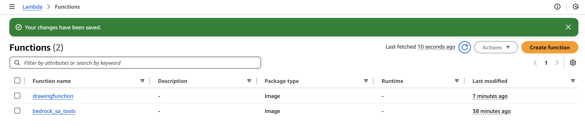

## Upload OpenAPI Spec

The [OpenAPI Specification (OAS)](https://swagger.io/specification/) defines a standard, language-agnostic interface to HTTP APIs which allows both humans and computers to discover and understand the capabilities of the service without access to source code.

Our agent will be able to understand what tool to use based on the request given to the user and then call the correct endpoint due to the OpenAPI spec.

You will need to upload the `agent_aws_openapi.json` [file to an S3 bucket](https://docs.aws.amazon.com/AmazonS3/latest/userguide/upload-objects.html).

## Create Action Group

An action is a task that the agent can perform automatically by making API calls to your company systems. A set of actions is defined in an action group. The OpenAPI schema defines the API for all the actions in the group. The agent will invoke our Lambda function based on request, that will invoke the tools we built.

1. To begin go to the Agents List Page and search for the Agent created earlier and click the Agent Name to load the agent details.

2. Click on the `Working draft` link to go into the Agent and add the agent action.

3. Click on the `Add` button in Action groups section to create a new Action Group for the agent. You can use "API that helps customer with knowledge of AWS by querying the AWS Well Architected Framework, writing codes and creating diagrams."
for the description.

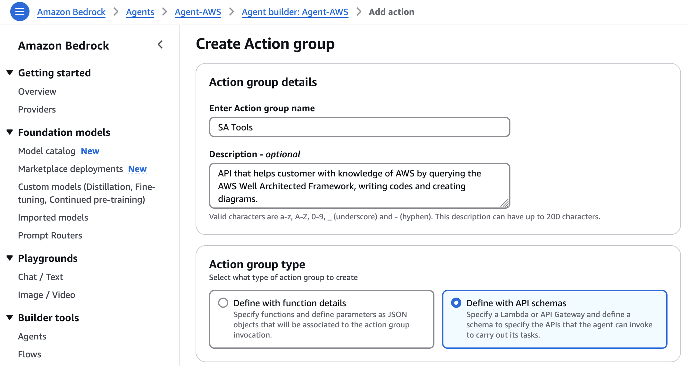

4. For the "Action Group Invocation" Select the lambda function we created "bedrock_sa_tools"

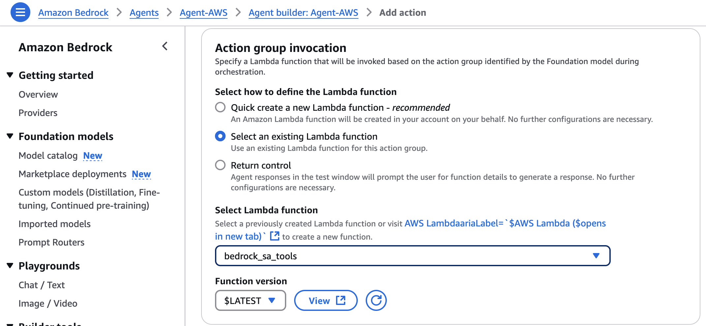

Select the S3 object for the API spec uploaded earlier(agent_aws_openapi.json)


5. Click on `Save and exit` button in the right bottom of the page.

6. Do the same for drawing function agent and create a new action group for this one. Only difference is from "Action Group Type", you need to select 
"Define with function details" and add keywords as parameters as below:

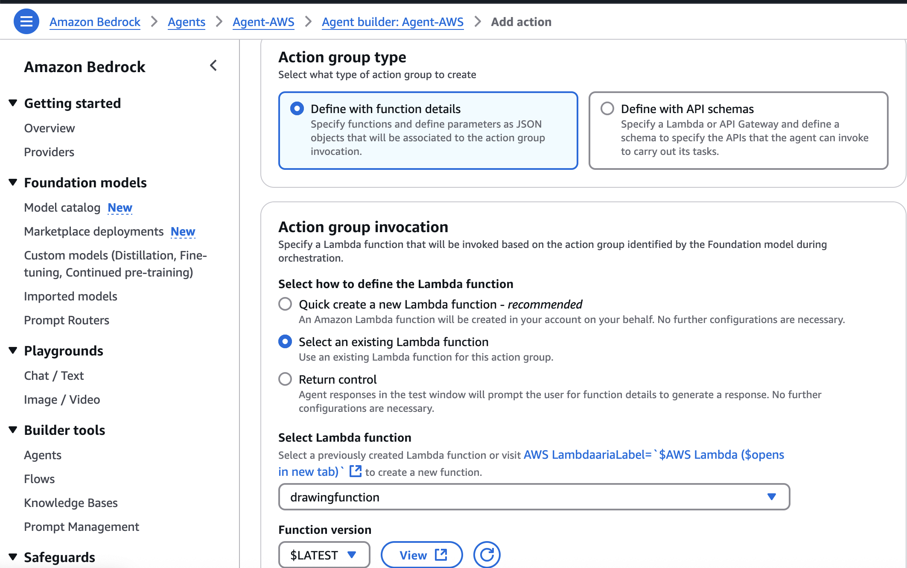
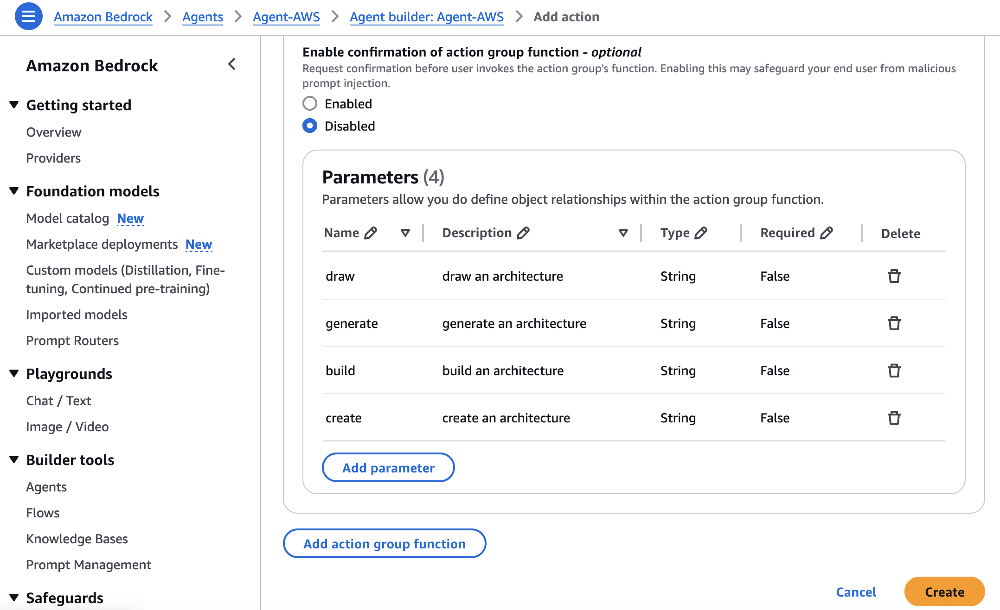

6. Once the Agent Status is in `Ready` state in Agent home page. You should see the below action groups and you can start the testing.

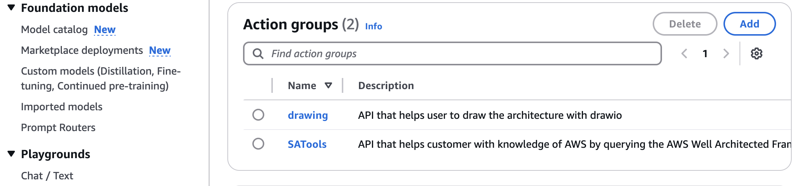

## Running the Chatbot

To start the Streamlit application, first you need to change the "Agent ID" in the agent2_tools.py in the drawings folder:
```bash

streamlit run chatbot_st.py
```

This will launch the chatbot interface in your default web browser. Make sure the port 8501 is open for streamlit external ip connection.


