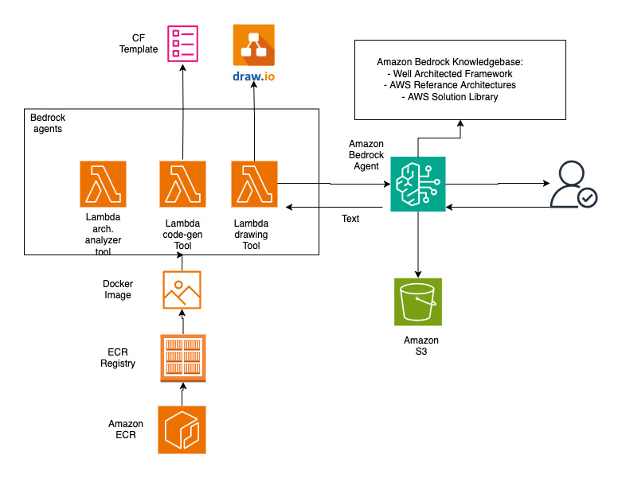

# AWS Architecture-Designer

## Leveraging Amazon Bedrock for Cloud Architecture Design

This pattern demonstrates how to leverage Generative AI to accelerate and optimize cloud architecture design processes. The solution enables architects and development teams to generate standardized architecture patterns, optimize resource configurations, ensure compliance, and create detailed documentation. The implementation utilizes Amazon Bedrock capabilities to access enterprise data, generate recommendations, and automate architecture-related tasks while maintaining security and compliance requirements. This solution uses the following AWS services:

- Amazon Bedrock for AI-powered assistance and automation
- Amazon ECR
- Amazon S3 for data storage
- AWS Lambda
- AWS IAM for security and access control
- Drawio for drawings


The pattern addresses common challenges in cloud architecture design, including:

- Accelerating architecture design processes
- Ensuring compliance with best practices
- Visualisation and guidence of architecture design with Drawio
- Optimizing resource utilization and costs
- Maintaining consistent documentation
- Enabling collaboration across teams


This solution is particularly valuable for organizations seeking to streamline their cloud architecture design process while maintaining high standards of quality and compliance. With the help of this tool you can:

- Generate an AWS architecture Design and drawing by either providing the technical requirements as a text or you can upload a Business Requirement Document by upload function to provide details.
- Generate Cloud formation Template based on the designed architecture
- Upload your architectural drawings and ask the tool for explaning the details of the architecture
- Estimate costs for the proposed architecture.

## Solution Architecture




## Prerequisites

- AWS CLI configured with appropriate permissions
- Docker installed and running
- Python 3.8 or later
- Node.js 14 or later (for CDK)
- npm install -g aws-cdk@latest


## Setup

1. Clone the repository:
   
  ```
  git clone git@github.com:aws-samples/sample-ai-powered-sdlc-patterns-with-aws.git

  cd sample-ai-powered-sdlc-patterns-with-aws/design-and-architecture/design-solutionarchitecture-agent

  ```
2. Create and activate a virtual environment:

```
 python3 -m venv .venv
 source .venv/bin/activate
 pip install -r requirements.txt
 cd functions/drawing_function/

```

3. Install dependencies:

```
 pip install -r requirements.txt
```

4. Before moving to cdk setup; In the functions/drawing_function folder, run below commands:
   
``` bash

   chmod +x make_pil_layer.sh
   chmod +x make_request_layer.sh
   ./make_pil_layer.sh
   ./make_request_layer.sh

```

5. Bootstrap your AWS environment (if not already done):

```
$ cdk bootstrap
```

## Deployment

To deploy the stack:

```
$ cdk deploy
```

This will:
- Build and push the Docker image to ECR
- Create the Lambda function
- Set up the S3 bucket
- Create the Bedrock agent with the OpenAPI schema

## Useful commands

 * `cdk ls`          list all stacks in the app
 * `cdk synth`       emits the synthesized CloudFormation template
 * `cdk deploy`      deploy this stack to your default AWS account/region
 * `cdk diff`        compare deployed stack with current state
 * `cdk docs`        open CDK documentation


### Streamlit UI for AWS SA AGENT

Then, in any other terminal, navigate to the [**streamlit** folder](streamlit/README.md) to run the Streamlit UI app and execute architecture-related commands.

```

cd ../../streamlit/

```

**Install Python dependencies**
```
pip install -r requirements.txt
```

**Set environment variables**
```
export AWS_DEFAULT_REGION=us-west-2
export AGENT_ID= XXXXXXXX # WRITE YOUR BEDROCK AGENT ID
# SET ALSO AWS CREDENTIALS
```


**Run the Streamlit app:**
```
streamlit run chatbot.py
```


### Manual Setup
If you prefer to install everything manually, follow the steps outlined in the [**README-ManualSetup.md**](README-ManualSetup.md) file.

## Clean up

Move to the `cdk` folder

```
cd cdk
```
Run the following command to destroy the Amazon Q Application

```
cdk destroy --all
```

## Security

_See CONTRIBUTING for more information._

## License

_This library is licensed under the MIT-0 License. See the LICENSE file._

## Disclaimer

_The solution architecture sample code is provided without any guarantees, and you're not recommended to use it for production-grade workloads. The intention is to provide content to build and learn. Be sure of reading the licensing terms._
