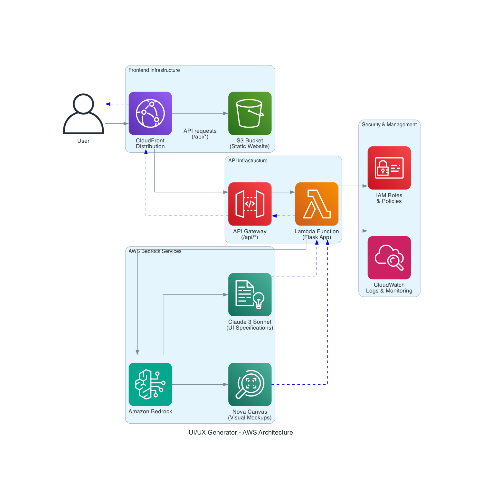

# UI/UX Generator with Amazon Bedrock


A powerful application that leverages Amazon Bedrock's AI capabilities to generate UI/UX designs from text descriptions. This tool helps designers and developers quickly create mockups, detailed specifications, and Figma component descriptions.

## Features

- **AI-Powered UI Mockup Generation**: Create visual mockups from text descriptions using Amazon Nova Canvas
- **Batch Image Generation**: Generate 2-4 variations in a single optimized API call to avoid throttling
- **Tabbed Interface**: Each generated variation gets its own tab with dedicated specifications
- **Per-Image UI/UX Specifications**: Generate individual UI descriptions for each variation using Claude 3 Haiku
- **Per-Image Figma Component Specifications**: Get precise component specifications for each variation with exact dimensions, colors, typography, and auto layout settings
- **Responsive Design Considerations**: AI-generated designs include responsive design recommendations
- **Accessibility Guidelines**: Built-in accessibility considerations in generated specifications
- **Smart Model Fallback**: Automatic fallback from Claude 3 Haiku to Claude 3 Opus if needed

## Architecture


The application consists of two main components:

1. **Backend (Python on AWS Lambda)**
   - Serverless API using AWS Lambda
   - Direct integration with AWS Bedrock services
   - Secure IAM-based authentication
   - Optimized for performance and reliability

2. **Frontend (React)**
   - Modern UI built with React and Material UI
   - Responsive design for desktop and mobile
   - Real-time preview of generated designs
   - Markdown rendering for specifications

## Prerequisites

- **AWS Account** with access to Amazon Bedrock
- **AWS CLI** configured with appropriate permissions
- **Python 3.8+**
- **Node.js 14+**
- **npm** or **yarn**

## AWS Bedrock Models Used

- **Claude 3 Haiku**: Primary model for generating UI/UX specifications and component descriptions (fast, cost-effective)
- **Claude 3 Opus**: Fallback model for text generation (high-quality, comprehensive responses)
- **Amazon Nova Canvas**: For generating visual mockups (batch generation up to 5 images per API call)

## Testing

This project includes a comprehensive testing suite with **80%+ code coverage** for both frontend (React/Jest) and backend (Python/pytest) components.

### Quick Start - Run All Tests
```bash
# Run complete test suite with coverage
./test-all.sh

# Run with coverage reports
./test-all.sh coverage coverage
```

### Individual Component Testing
```bash
# Frontend only (React/Jest)
cd frontend && ./test.sh coverage

# Backend only (Python/pytest)  
cd backend && ./test.sh coverage

# Watch mode for development
cd frontend && ./test.sh watch
```

### Test Coverage Reports
- **Frontend**: `frontend/coverage/lcov-report/index.html`
- **Backend**: `backend/htmlcov/index.html`
- **Combined**: `coverage-combined/index.html`

### Available Test Scripts
- `./test-all.sh` - Master script (runs both frontend & backend)
- `frontend/test.sh` - Frontend tests with npm/Jest
- `backend/test.sh` - Backend tests with pytest

**Features**: Comprehensive mocking of AWS services, error handling, accessibility testing, performance monitoring, and security validation.

📖 **Detailed Guide**: See [TESTING.md](TESTING.md) for complete documentation.

## Installation

### Local Setup

#### Clone the Repository

```bash
git clone https://github.com/yourusername/ui-generator.git
cd ui-generator
```

#### Backend Setup

```bash
cd backend
python -m venv venv
source venv/bin/activate  # On Windows: venv\Scripts\activate
pip install -r requirements.txt
```

#### Frontend Setup

```bash
cd frontend
npm install
```

#### AWS Configuration

1. Configure AWS CLI:
   ```bash
   aws configure
   ```

2. Request access to required Bedrock models:
   - Go to the [Amazon Bedrock console](https://console.aws.amazon.com/bedrock)
   - Navigate to "Model access"
   - Request access to:
     - Claude 3 Haiku (anthropic.claude-3-haiku-20240307-v1:0)
     - Claude 3 Opus (anthropic.claude-3-opus-20240229-v1:0)
     - Amazon Nova Canvas (amazon.nova-canvas-v1:0)

3. Verify your AWS configuration:
   ```bash
   ./aws-setup.sh --test
   ```

### AWS Deployment Setup

```bash
# Navigate to the CDK directory
cd cdk

# Install CDK dependencies
npm install
```

## Usage

### Local Application

To run the application locally:

```bash
# Start the application
./start.sh
```

This will:
1. Build the frontend for production
2. Start the backend server on port 8000, serving both the API and frontend

### Using the Application Locally

1. Open your browser and navigate to `http://localhost:8000`
2. Use the navigation bar to switch between **Home** and **About** pages
3. On the Home page, enter a detailed description of the UI/UX you want to create
4. Choose between single image or multiple variations (2-4 images)
5. Adjust generation parameters if needed (width, height)
6. Click "Generate Design" or "Generate X Variations"
7. View the generated mockup(s) in tabbed interface with individual descriptions and component specifications

**Application Status:**
- ✅ **Backend**: Running on port 8000 with full API functionality
- ✅ **Frontend**: Material Design interface with navigation (Home/About pages)
- ✅ **Security**: All npm audit vulnerabilities resolved (0 vulnerabilities)
- ✅ **Health Check**: Available at `http://localhost:8000/api/health`
- ✅ **Navigation**: Home and About pages with Material Design styling

**Features:**
- **Home Page**: Full UI generation functionality with Material Design form
- **About Page**: Comprehensive information about the application, features, and technology stack
- **Responsive Design**: Works on desktop and mobile devices
- **Real-time Health Monitoring**: Backend connection status indicator
- **Material Design**: Consistent Google Material Design styling throughout

### Using the Deployed Application

After deploying to AWS with CDK:

1. Open your browser and navigate to the CloudFront URL provided in the CDK output
2. Use the application as described above

## Example Prompts

- "Create a modern e-commerce product page with image gallery, product details, pricing, and add to cart functionality"
- "Design a dashboard for monitoring IoT devices with real-time status updates, charts, and alert notifications"
- "Create a mobile app login screen with social login options, forgot password functionality, and biometric authentication"

## Deployment

### AWS CDK Deployment

This project includes an AWS CDK deployment that sets up the following infrastructure:



- **Frontend**: Hosted on S3 and served through CloudFront
- **Backend**: Deployed as a Lambda function behind API Gateway
- **Security**: IAM roles with least privilege principle

To deploy the application to AWS:

```bash
# Navigate to the CDK directory
cd cdk

# Install dependencies
npm install

# Build the CDK project
npm run build

# Deploy to AWS
cdk deploy
```

After deployment, the CDK will output the CloudFront URL where your application is available.

### CloudFront Cache Invalidation

When you update your frontend code and redeploy, CloudFront may continue to serve cached versions of your files. To ensure users see the latest version, you need to invalidate the CloudFront cache:

```bash
# Using AWS CLI
aws cloudfront create-invalidation --distribution-id YOUR_DISTRIBUTION_ID --paths "/*"
```

Alternatively, you can use the AWS Console:
1. Go to the CloudFront console
2. Select your distribution
3. Go to the "Invalidations" tab
4. Create a new invalidation with the path pattern "/*"

Users can also perform a hard refresh in their browser (Shift+Refresh) to bypass their local cache.

For more details, see the [CDK README](cdk/README.md).

### Architecture

The application uses a serverless architecture on AWS with the following components:


1. **Backend (Python on AWS Lambda)**
   - Serverless API using AWS Lambda and API Gateway
   - Direct integration with AWS Bedrock services
   - Optimized for performance and reliability
   - Stateless design for scalability

2. **Frontend (React)**
   - Modern UI built with React and Material UI
   - Responsive design for desktop and mobile
   - Real-time preview of generated designs
   - Markdown rendering for specifications

3. **AWS Services**
   - **Lambda**: Hosts the serverless backend application
   - **API Gateway**: Provides RESTful API endpoints
   - **S3**: Stores the frontend static files
   - **CloudFront**: Delivers the frontend and proxies API requests
   - **IAM**: Manages permissions and roles
   - **Bedrock**: Provides AI models for UI generation

4. **Architecture Flow**
   - User accesses the CloudFront URL
   - Static content (HTML, JS, CSS) is served from the S3 bucket
   - API requests from the frontend go to CloudFront
   - CloudFront routes `/api/*` requests to API Gateway
   - API Gateway forwards requests to the Lambda function
   - Lambda executes the serverless handler code
   - The Lambda function processes the request using Bedrock services
   - Response flows back through Lambda → API Gateway → CloudFront → User

5. **API Endpoints**
   - `/api/generate-mockup`: Generates UI mockups using Bedrock
   - `/api/generate-description`: Generates UI descriptions
   - `/api/generate-components`: Generates Figma component specifications
   - `/api/check-bedrock-access`: Checks access to Bedrock models
   - `/api/assets/{filename}`: Serves generated assets
   - `/api/health`: Health check endpoint

## Security Considerations

- The application uses AWS IAM for authentication and authorization
- All API endpoints are protected with proper CORS configuration
- Environment variables are used for sensitive information
- Input validation is implemented to prevent injection attacks
- File paths are validated to prevent directory traversal attacks
- Security headers are added to all responses
- Bedrock permissions are scoped to specific actions

### Security Best Practices for Deployment

1. **Use HTTPS**: Always use HTTPS for production deployments
2. **Restrict API Access**: In production, restrict the CORS `Access-Control-Allow-Origin` header to specific domains
3. **Implement Rate Limiting**: Configure API Gateway with rate limiting to prevent abuse
4. **Enable CloudTrail**: Enable AWS CloudTrail to monitor API calls
5. **Regular Audits**: Regularly audit IAM permissions and remove unused roles
6. **Monitor CloudWatch Logs**: Set up alerts for suspicious activity in CloudWatch Logs

### Security

See CONTRIBUTING for more information.

## Troubleshooting

### Common Issues

#### 502 Bad Gateway Errors
- **Cause**: Lambda function timeout or error
- **Solution**: Check CloudWatch logs for errors, increase Lambda timeout or memory

#### CloudFront Caching Issues
- **Cause**: CloudFront serving old versions of files
- **Solution**: Invalidate the CloudFront cache or perform a hard refresh

#### Bedrock Model Access
- **Cause**: Missing access to required Bedrock models
- **Solution**: Request access to the models in the AWS Bedrock console

#### CORS Errors
- **Cause**: Incorrect CORS configuration
- **Solution**: Check the CORS settings in API Gateway and CloudFront

## Contributing

Contributions are welcome! Please feel free to submit a Pull Request.

1. Fork the repository
2. Create your feature branch (`git checkout -b feature/amazing-feature`)
3. **Run tests to ensure everything works**: `./test-all.sh`
4. Commit your changes (`git commit -m 'Add some amazing feature'`)
5. Push to the branch (`git push origin feature/amazing-feature`)
6. Open a Pull Request

### Development Setup

For local development:

1. Clone the repository
2. Set up the backend:
   ```bash
   cd backend
   python -m venv venv
   source venv/bin/activate  # On Windows: venv\Scripts\activate
   pip install -r requirements.txt
   ```
3. Set up the frontend:
   ```bash
   cd frontend
   npm install
   ```
4. **Run tests to verify setup**:
   ```bash
   ./test-all.sh
   ```
5. Start the application:
   ```bash
   ./start.sh
   ```

### Coding Standards

- Follow standard coding practices for Python and JavaScript
- Add comments and documentation for new features
- **Write tests for new functionality** (80%+ coverage required)
- **Run tests before submitting PRs**: `./test-all.sh`
- Follow the existing project structure

## Disclaimer

The solution architecture sample code is provided without any guarantees, and you're not recommended to use it for production-grade workloads. The intention is to provide content to build and learn. Be sure of reading the licensing terms.

## License

This project is licensed under the MIT License - see the [LICENSE](LICENSE) file for details.

## Acknowledgments

- Amazon Bedrock team for providing the AI models
- Flask and React communities for the excellent frameworks
- All contributors who have helped improve this project