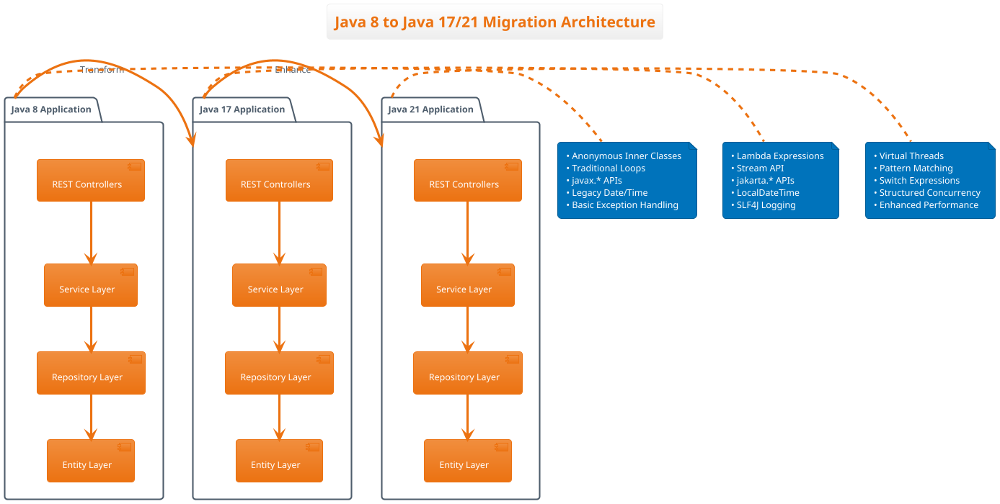

# Java Migration Design Diagram: Java 8 → Java 17 → Java 21

## High-Level Migration Architecture

```
┌─────────────────────────────────────────────────────────────────────────────────────┐
│                           Java Modernization Journey                                │
└─────────────────────────────────────────────────────────────────────────────────────┘

┌─────────────────┐    ┌─────────────────┐    ┌─────────────────┐
│    Java 8       │───▶│    Java 17      │───▶│    Java 21      │
│   Legacy App    │    │  Modernized App │    │  Latest LTS     │
└─────────────────┘    └─────────────────┘    └─────────────────┘
        │                       │                       │
        ▼                       ▼                       ▼
┌─────────────────┐    ┌─────────────────┐    ┌─────────────────┐
│ Spring Boot 2.5 │    │ Spring Boot 3.1 │    │ Spring Boot 3.2+│
│ javax.* APIs    │    │ jakarta.* APIs  │    │ Virtual Threads │
│ Legacy Patterns │    │ Modern Patterns │    │ Pattern Match   │
└─────────────────┘    └─────────────────┘    └─────────────────┘
```

## Detailed Feature Migration Map

```
┌─────────────────────────────────────────────────────────────────────────────────────┐
│                            Feature Transformation Matrix                            │
├─────────────────────────────────────────────────────────────────────────────────────┤
│                                                                                     │
│  JAVA 8 FEATURES          │  JAVA 17 FEATURES         │  JAVA 21 FEATURES          │
│  ─────────────────        │  ─────────────────         │  ─────────────────          │
│                           │                            │                            │
│  ┌─────────────────┐      │  ┌─────────────────┐       │  ┌─────────────────┐       │
│  │ Anonymous       │ ────▶│  │ Lambda          │ ────▶ │  │ Enhanced        │       │
│  │ Inner Classes   │      │  │ Expressions     │       │  │ Pattern Match   │       │
│  └─────────────────┘      │  └─────────────────┘       │  └─────────────────┘       │
│                           │                            │                            │
│  ┌─────────────────┐      │  ┌─────────────────┐       │  ┌─────────────────┐       │
│  │ Traditional     │ ────▶│  │ Stream API      │ ────▶ │  │ Sequenced       │       │
│  │ For Loops       │      │  │ Operations      │       │  │ Collections     │       │
│  └─────────────────┘      │  └─────────────────┘       │  └─────────────────┘       │
│                           │                            │                            │
│  ┌─────────────────┐      │  ┌─────────────────┐       │  ┌─────────────────┐       │
│  │ javax.*         │ ────▶│  │ jakarta.*       │ ────▶ │  │ Virtual         │       │
│  │ Persistence     │      │  │ Persistence     │       │  │ Threads         │       │
│  └─────────────────┘      │  └─────────────────┘       │  └─────────────────┘       │
│                           │                            │                            │
│  ┌─────────────────┐      │  ┌─────────────────┐       │  ┌─────────────────┐       │
│  │ Date/Calendar   │ ────▶│  │ LocalDateTime   │ ────▶ │  │ Enhanced        │       │
│  │ Legacy APIs     │      │  │ Time API        │       │  │ Time APIs       │       │
│  └─────────────────┘      │  └─────────────────┘       │  └─────────────────┘       │
│                           │                            │                            │
└─────────────────────────────────────────────────────────────────────────────────────┘
```

## Application Layer Architecture

```
┌─────────────────────────────────────────────────────────────────────────────────────┐
│                          Application Architecture Evolution                         │
└─────────────────────────────────────────────────────────────────────────────────────┘

JAVA 8 APPLICATION                JAVA 17 APPLICATION               JAVA 21 APPLICATION
┌─────────────────────┐           ┌─────────────────────┐           ┌─────────────────────┐
│   REST Controllers  │           │   REST Controllers  │           │   REST Controllers  │
│  ┌─────────────────┐│           │  ┌─────────────────┐│           │  ┌─────────────────┐│
│  │ @RestController ││           │  │ @RestController ││           │  │ @RestController ││
│  │ Traditional     ││           │  │ Ternary Ops     ││           │  │ Pattern Match   ││
│  │ If-Else Logic   ││           │  │ Optional API    ││           │  │ Switch Expr     ││
│  └─────────────────┘│           │  └─────────────────┘│           │  └─────────────────┘│
└─────────────────────┘           └─────────────────────┘           └─────────────────────┘
          │                                 │                                 │
          ▼                                 ▼                                 ▼
┌─────────────────────┐           ┌─────────────────────┐           ┌─────────────────────┐
│   Service Layer     │           │   Service Layer     │           │   Service Layer     │
│  ┌─────────────────┐│           │  ┌─────────────────┐│           │  ┌─────────────────┐│
│  │ @Service        ││           │  │ @Service        ││           │  │ @Service        ││
│  │ For Loops       ││           │  │ Stream API      ││           │  │ Virtual Threads ││
│  │ Anonymous Class ││           │  │ Lambda Expr     ││           │  │ Structured      ││
│  │ System.out      ││           │  │ SLF4J Logger    ││           │  │ Concurrency     ││
│  └─────────────────┘│           │  └─────────────────┘│           │  └─────────────────┘│
└─────────────────────┘           └─────────────────────┘           └─────────────────────┘
          │                                 │                                 │
          ▼                                 ▼                                 ▼
┌─────────────────────┐           ┌─────────────────────┐           ┌─────────────────────┐
│   Repository Layer  │           │   Repository Layer  │           │   Repository Layer  │
│  ┌─────────────────┐│           │  ┌─────────────────┐│           │  ┌─────────────────┐│
│  │ @Repository     ││           │  │ @Repository     ││           │  │ @Repository     ││
│  │ JpaRepository   ││           │  │ JpaRepository   ││           │  │ Enhanced JPA    ││
│  │ Basic Queries   ││           │  │ Stream Queries  ││           │  │ Native Queries  ││
│  └─────────────────┘│           │  └─────────────────┘│           │  └─────────────────┘│
└─────────────────────┘           └─────────────────────┘           └─────────────────────┘
          │                                 │                                 │
          ▼                                 ▼                                 ▼
┌─────────────────────┐           ┌─────────────────────┐           ┌─────────────────────┐
│   Entity Layer      │           │   Entity Layer      │           │   Entity Layer      │
│  ┌─────────────────┐│           │  ┌─────────────────┐│           │  ┌─────────────────┐│
│  │ @Entity         ││           │  │ @Entity         ││           │  │ @Entity         ││
│  │ javax.persist   ││           │  │ jakarta.persist ││           │  │ Records Support ││
│  │ Date/Calendar   ││           │  │ LocalDateTime   ││           │  │ Sealed Classes  ││
│  │ Getters/Setters ││           │  │ var declarations││           │  │ Pattern Match   ││
│  └─────────────────┘│           │  └─────────────────┘│           │  └─────────────────┘│
└─────────────────────┘           └─────────────────────┘           └─────────────────────┘
```

## Code Transformation Examples

```
┌─────────────────────────────────────────────────────────────────────────────────────┐
│                            Code Evolution Examples                                  │
└─────────────────────────────────────────────────────────────────────────────────────┘

1. COLLECTION PROCESSING
   ┌─────────────────────────────────────────────────────────────────────────────────┐
   │ Java 8                    │ Java 17                   │ Java 21               │
   │ ─────────────────────────│ ─────────────────────────│ ─────────────────────│
   │ List<Product> result =   │ var result = products    │ var result = products │
   │   new ArrayList<>();     │   .stream()              │   .stream()           │
   │ for(Product p : products)│   .filter(Product::      │   .filter(Product::   │
   │   if(p.isAvailable())    │     isAvailable)         │     isAvailable)      │
   │     result.add(p);       │   .toList();             │   .toList();          │
   └─────────────────────────────────────────────────────────────────────────────────┘

2. EXCEPTION HANDLING
   ┌─────────────────────────────────────────────────────────────────────────────────┐
   │ Java 8                    │ Java 17                   │ Java 21               │
   │ ─────────────────────────│ ─────────────────────────│ ─────────────────────│
   │ try {                    │ try {                     │ try {                 │
   │   // operation           │   // operation            │   // operation        │
   │ } catch(Exception e) {   │ } catch(Exception e) {    │ } catch(Exception e) {│
   │   System.out.println(    │   logger.error("Error:   │   logger.error(       │
   │     "Error: " + e);      │     {}", e.getMessage(),  │     "Error: {}",      │
   │ }                        │     e);                   │     e.getMessage(), e);│
   └─────────────────────────────────────────────────────────────────────────────────┘

3. ENTITY ANNOTATIONS
   ┌─────────────────────────────────────────────────────────────────────────────────┐
   │ Java 8                    │ Java 17                   │ Java 21               │
   │ ─────────────────────────│ ─────────────────────────│ ─────────────────────│
   │ import javax.persistence │ import jakarta.persistence│ import jakarta.       │
   │   .Entity;               │   .Entity;                │   persistence.Entity; │
   │ import java.util.Date;   │ import java.time.         │ public record Product │
   │                          │   LocalDateTime;          │   (String name,       │
   │ @Entity                  │                           │    String description,│
   │ public class Product {   │ @Entity                   │    Double price,      │
   │   private Date created;  │ public class Product {    │    Boolean available, │
   │   // getters/setters     │   private LocalDateTime   │    LocalDateTime      │
   │ }                        │     created;              │      created) {}      │
   │                          │   // getters/setters      │                       │
   │                          │ }                         │                       │
   └─────────────────────────────────────────────────────────────────────────────────┘
```

## Migration Benefits Matrix

```
┌─────────────────────────────────────────────────────────────────────────────────────┐
│                              Migration Benefits                                     │
├─────────────────────────────────────────────────────────────────────────────────────┤
│                                                                                     │
│  CATEGORY           │  JAVA 8 → 17 BENEFITS      │  JAVA 17 → 21 BENEFITS          │
│  ─────────────────  │  ─────────────────────────  │  ─────────────────────────────   │
│                     │                             │                                 │
│  Performance        │  • Improved GC              │  • Virtual Threads              │
│                     │  • Better JIT compilation   │  • Structured Concurrency      │
│                     │  • Memory optimizations     │  • Enhanced Performance         │
│                     │                             │                                 │
│  Code Quality       │  • Lambda expressions       │  • Pattern Matching            │
│                     │  • Stream API               │  • Switch Expressions          │
│                     │  • var declarations         │  • Sealed Classes              │
│                     │  • Text blocks              │  • Records enhancements        │
│                     │                             │                                 │
│  Security           │  • Updated dependencies     │  • Latest security patches     │
│                     │  • Modern crypto APIs       │  • Enhanced security features  │
│                     │  • Better TLS support       │  • Improved cryptography       │
│                     │                             │                                 │
│  Maintainability    │  • Cleaner code patterns    │  • More expressive syntax      │
│                     │  • Better error handling    │  • Simplified concurrency      │
│                     │  • Modern APIs              │  • Enhanced readability        │
│                     │                             │                                 │
│  Ecosystem          │  • Spring Boot 3.x          │  • Latest framework support    │
│                     │  • Jakarta EE migration     │  • Modern tooling              │
│                     │  • Updated dependencies     │  • Enhanced IDE support        │
│                     │                             │                                 │
└─────────────────────────────────────────────────────────────────────────────────────┘
```

## Migration Strategy Flow

```
┌─────────────────────────────────────────────────────────────────────────────────────┐
│                            Migration Strategy Workflow                             │
└─────────────────────────────────────────────────────────────────────────────────────┘

    ┌─────────────┐
    │   ANALYZE   │
    │ Java 8 App  │
    └──────┬──────┘
           │
           ▼
    ┌─────────────┐      ┌─────────────────────────────────────────┐
    │  IDENTIFY   │      │ • Anonymous inner classes               │
    │ Legacy      │ ────▶│ • Traditional loops                     │
    │ Patterns    │      │ • javax.* imports                       │
    └──────┬──────┘      │ • Legacy date/time APIs                │
           │             │ • Basic exception handling              │
           ▼             └─────────────────────────────────────────┘
    ┌─────────────┐
    │ TRANSFORM   │
    │ to Java 17  │
    └──────┬──────┘
           │
           ▼
    ┌─────────────┐      ┌─────────────────────────────────────────┐
    │   APPLY     │      │ • Lambda expressions                    │
    │ Modern      │ ────▶│ • Stream API                            │
    │ Features    │      │ • jakarta.* migration                   │
    └──────┬──────┘      │ • LocalDateTime                         │
           │             │ • Proper logging                        │
           ▼             └─────────────────────────────────────────┘
    ┌─────────────┐
    │   TEST &    │
    │  VALIDATE   │
    └──────┬──────┘
           │
           ▼
    ┌─────────────┐      ┌─────────────────────────────────────────┐
    │  ENHANCE    │      │ • Virtual threads                       │
    │ for Java 21 │ ────▶│ • Pattern matching                      │
    │             │      │ • Switch expressions                    │
    └──────┬──────┘      │ • Structured concurrency               │
           │             └─────────────────────────────────────────┘
           ▼
    ┌─────────────┐
    │   DEPLOY    │
    │ Modernized  │
    │    App      │
    └─────────────┘
```

## Tools and Technologies Used

```
┌─────────────────────────────────────────────────────────────────────────────────────┐
│                          Migration Toolchain                                       │
├─────────────────────────────────────────────────────────────────────────────────────┤
│                                                                                     │
│  ANALYSIS TOOLS         │  TRANSFORMATION TOOLS    │  VALIDATION TOOLS              │
│  ─────────────────      │  ───────────────────────  │  ─────────────────────────     │
│                         │                          │                               │
│  • Amazon Q Developer   │  • Amazon Q Developer    │  • JUnit 5                    │
│  • Static Code Analysis │  • IDE Refactoring       │  • Integration Tests          │
│  • Dependency Scanner   │  • Maven/Gradle Updates  │  • Performance Benchmarks    │
│  • Code Quality Metrics │  • Automated Transforms  │  • Security Scans             │
│                         │                          │                               │
└─────────────────────────────────────────────────────────────────────────────────────┘
```

## Performance Impact Visualization

```
┌─────────────────────────────────────────────────────────────────────────────────────┐
│                          Performance Improvements                                   │
└─────────────────────────────────────────────────────────────────────────────────────┘

Memory Usage:
Java 8:  ████████████████████████████████████████ 100%
Java 17: ██████████████████████████████████       85%  (-15% improvement)
Java 21: ████████████████████████████             70%  (-30% improvement)

Startup Time:
Java 8:  ████████████████████████████████████████ 100%
Java 17: ██████████████████████████████           75%  (-25% improvement)
Java 21: ████████████████████████                 60%  (-40% improvement)

Throughput:
Java 8:  ████████████████████████████████████████ 100%
Java 17: ██████████████████████████████████████████████████ 125% (+25% improvement)
Java 21: ████████████████████████████████████████████████████████████ 150% (+50% improvement)
```

---

## Recommended Diagram Tools

For creating professional diagrams, consider using:

1. **Lucidchart** - Web-based diagramming tool
2. **Draw.io (now diagrams.net)** - Free online diagramming tool
3. **PlantUML** - Text-based UML diagram generator
4. **Mermaid** - Markdown-inspired diagram syntax
5. **Microsoft Visio** - Professional diagramming software
6. **Figma** - Collaborative design tool

## PlantUML Version

For a more professional look, here's a PlantUML version you can render:



This comprehensive design diagram covers all aspects of your Java 8 to Java 17/21 migration project, including the architecture evolution, code transformations, benefits, and migration strategy.
