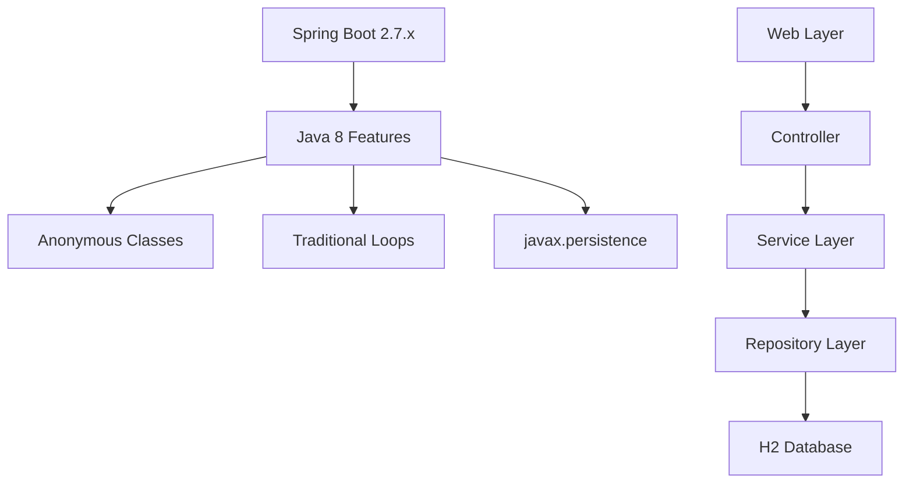

# Java 8 Legacy Application

[](https://openjdk.java.net/)
[](https://spring.io/projects/spring-boot)
[](https://maven.apache.org/)

This is the **legacy Java 8 Spring Boot application** that serves as the starting point for modernization using Amazon Q Developer. It demonstrates traditional Java 8 patterns and practices that can be modernized to take advantage of newer Java features.

## 🎯 Purpose

This application represents a typical Java 8 enterprise application with:
- Traditional coding patterns
- Legacy dependency management
- Older Spring Boot version (2.7.x)
- Java 8 specific implementations

## 🏗️ Architecture



## 📁 Project Structure

```
java8-app/
├── src/main/java/com/example/java8app/
│   ├── Java8Application.java          # Main application class
│   ├── config/
│   │   └── DataInitializer.java       # Database initialization
│   ├── controller/
│   │   ├── HomeController.java        # Web controller
│   │   ├── ProductController.java     # REST API controller
│   │   ├── CodeAnalysisController.java # Code analysis endpoints
│   │   └── DocumentationController.java # Documentation endpoints
│   ├── model/
│   │   └── Product.java               # JPA entity (javax.persistence)
│   ├── repository/
│   │   └── ProductRepository.java     # Spring Data repository
│   └── service/
│       └── ProductService.java        # Business logic with Java 8 patterns
├── src/main/resources/
│   ├── application.properties         # Application configuration
│   ├── static/                        # Static web assets
│   └── templates/                     # Thymeleaf templates
└── src/test/java/                     # Test classes
```

## 🔧 Java 8 Features Demonstrated

### 1. Anonymous Inner Classes
```java
// Traditional anonymous inner class pattern
Comparator<Product> priceComparator = new Comparator<Product>() {
    @Override
    public int compare(Product p1, Product p2) {
        return p1.getPrice().compareTo(p2.getPrice());
    }
};
```

### 2. Traditional For Loops
```java
// Traditional for-each loops instead of streams
List<Product> availableProducts = new ArrayList<>();
for (Product product : products) {
    if (product.isAvailable()) {
        availableProducts.add(product);
    }
}
```

### 3. Legacy JPA Annotations
```java
// Using javax.persistence instead of jakarta.persistence
import javax.persistence.Entity;
import javax.persistence.GeneratedValue;
import javax.persistence.Id;
```

### 4. Traditional Exception Handling
```java
// Traditional try-catch without try-with-resources
FileInputStream fis = null;
try {
    fis = new FileInputStream(file);
    // process file
} catch (IOException e) {
    // handle exception
} finally {
    if (fis != null) {
        try {
            fis.close();
        } catch (IOException e) {
            // handle close exception
        }
    }
}
```

## 🚀 Running the Application

### Prerequisites
- Java 8 or higher
- Maven 3.8+

### Start the Application
```bash
# Using Maven wrapper
./mvnw spring-boot:run

# Or using Maven directly
mvn spring-boot:run
```

The application will start on **http://localhost:8080**

### Available Endpoints

#### Web Interface
- `GET /` - Home page with product listing
- `GET /requirements` - Requirements analysis page
- `GET /system-behavior` - System behavior documentation
- `GET /code-analysis` - Code analysis and metrics

#### REST API
- `GET /api/products` - Get all products
- `GET /api/products/{id}` - Get product by ID
- `POST /api/products` - Create new product
- `PUT /api/products/{id}` - Update product
- `DELETE /api/products/{id}` - Delete product
- `GET /api/products/sorted` - Get products sorted by price
- `GET /api/products/available` - Get available products only
- `GET /api/products/inventory-value` - Get total inventory value

## 🤖 AI Modernization Prompts Used

### Initial Application Creation
```
Create a Java 8 Spring Boot application that demonstrates legacy patterns:

1. Use Spring Boot 2.7.x for compatibility with Java 8
2. Implement a Product entity with javax.persistence annotations
3. Create a ProductService with traditional Java 8 patterns:
   - Anonymous inner classes for comparators
   - Traditional for loops instead of streams
   - Manual null checking without Optional
4. Add a REST controller with basic CRUD operations
5. Include a web interface using Thymeleaf templates
6. Use H2 in-memory database for simplicity
7. Add sample data initialization
8. Include traditional exception handling patterns

Focus on creating code that clearly shows Java 8 limitations and modernization opportunities.
```

### Service Layer Implementation
```
Implement the ProductService class using Java 8 patterns that need modernization:

1. Use anonymous inner classes for sorting and filtering
2. Implement traditional for loops for collection processing
3. Use manual null checking instead of Optional
4. Implement traditional exception handling without try-with-resources
5. Use StringBuilder for string concatenation in loops
6. Implement manual stream-like operations with traditional loops
7. Add methods that demonstrate verbose Java 8 patterns

Make the code functional but clearly show areas for improvement with modern Java.
```

### Web Layer Development
```
Create web controllers and templates for the Java 8 application:

1. HomeController with Thymeleaf integration
2. ProductController for REST API endpoints
3. Add controllers for documentation and code analysis
4. Create responsive HTML templates with Bootstrap
5. Include forms for product management
6. Add error handling pages
7. Implement basic CSS styling
8. Show product statistics and metrics

Focus on creating a complete web application that demonstrates the business logic.
```

## 🔍 Modernization Opportunities

This application is designed to showcase areas where Amazon Q Developer can help modernize:

### 1. **Lambda Expressions**
- Replace anonymous inner classes with lambda expressions
- Simplify functional interfaces usage

### 2. **Stream API**
- Convert traditional loops to stream operations
- Use collectors for data aggregation
- Implement parallel processing where appropriate

### 3. **Optional Usage**
- Replace null checking with Optional
- Use Optional chaining for cleaner code

### 4. **Modern Exception Handling**
- Implement try-with-resources
- Use multi-catch blocks
- Add proper resource management

### 5. **Framework Updates**
- Migrate from Spring Boot 2.7.x to 3.x
- Update from javax.persistence to jakarta.persistence
- Use modern Spring features

### 6. **Code Quality Improvements**
- Reduce boilerplate code
- Improve readability and maintainability
- Add modern testing patterns

## 📊 Code Metrics

| Metric | Value | Modernization Target |
|--------|-------|---------------------|
| **Lines of Code** | ~800 | Reduce by 20-30% |
| **Cyclomatic Complexity** | High | Reduce with streams |
| **Code Duplication** | Present | Eliminate with lambdas |
| **Null Pointer Risk** | High | Mitigate with Optional |

## 🧪 Testing

```bash
# Run all tests
./mvnw test

# Run with coverage
./mvnw test jacoco:report
```

## 📚 Learning Resources

- [Java 8 Features Overview](https://docs.oracle.com/javase/8/docs/technotes/guides/language/enhancements.html)
- [Spring Boot 2.7 Documentation](https://docs.spring.io/spring-boot/docs/2.7.x/reference/html/)
- [Legacy Code Modernization Patterns](https://martinfowler.com/articles/refactoring-legacy-code.html)

## ➡️ Next Steps

1. **Analyze the Code**: Review the Java 8 patterns and identify modernization opportunities
2. **Use Amazon Q Developer**: Apply AI-powered transformations to modernize the code
3. **Compare Results**: See the improvements in the Java 17 and Java 21 versions
4. **Deploy Modern Version**: Use the modernized applications for production

---

**This application serves as the foundation for demonstrating Amazon Q Developer's Java modernization capabilities.**
