# IT operations support automation with CloudWatch investigations

## Introduction

This solution leverages [CloudWatch investigations](https://docs.aws.amazon.com/AmazonCloudWatch/latest/monitoring/Investigations.html) to automate first-level IT operations support. It analyses system telemetry to automatically perform initial troubleshooting, surface suggestions to operators with context, and propose remediations. This solution reduces the workload on IT teams while providing faster resolution times for common issues.

**Benefits:**
- Reduces mean time to resolution (MTTR) for common IT incidents
- Automates first-level troubleshooting and investigation
- Provides consistent handling of incidents with AI-driven insights
- Seamlessly integrates with existing chat tools
- Allows operators to focus on complex issues while automating routine tasks

## Solution Architecture


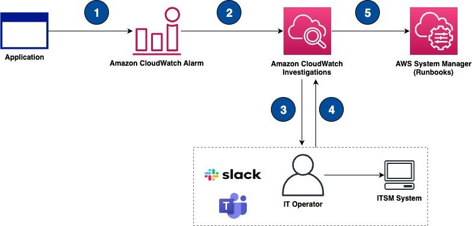

1. CloudWatch detects an anomaly or threshold breach which triggers an alarm
2. CloudWatch Investigation is triggered automatically by CloudWatch Alarm (it can also be manually triggered by Operator)
3. CloudWatch Investigation the alert, correlates data, initiates an investigation and notify Operator (Which can be integrated with Chat applications)
4. Operators can:
    1. Chat with Amazon Q for more details or to ask questions
    2. Review and approve recommended remediation actions
    3. Use the findings to open and managed more detailed ITSM Systems incidents. 
5. Runbooks from AWS System Manager might be proposed and available to be executed, if the hypothesis for the issue is accepted.

### Solution Components

This solutions uses Lambda functions, to simulate read and write throttling and capacity limit on a Amazon DynamoDB. To invoke the AWS Lambda function, Amazon EventBridge rule is configured and can be activated to invoke the Lambda every 1 minute.

The solution will also configure a [CloudWatch investigations](https://docs.aws.amazon.com/AmazonCloudWatch/latest/monitoring/Investigations.html), which will automatically be triggered if the CloudWatch Alarm is in Alert.

### AWS Services Used
- Amazon CloudWatch
  - CloudWatch investigations
- Amazon EventBridge
- Amazon DynamoDB
- AWS Lambda
  - With AWS Lambda Insights activated
  - IAM Permissions: 
    - *X-Ray Permission*: Lambda execution role uses [AWS managed policies](https://docs.aws.amazon.com/IAM/latest/UserGuide/access_policies_managed-vs-inline.html#aws-managed-policies), the permission [AWSXRayDaemonWriteAccess](https://docs.aws.amazon.com/lambda/latest/dg/services-xray.html#services-xray-permissions) which contains **wildcard** resource scope. Adjust the policies based on your workload requirement.
    - *CloudWatch Logs Permission*: Lambda execution role uses [AWS managed policies](https://docs.aws.amazon.com/IAM/latest/UserGuide/access_policies_managed-vs-inline.html#aws-managed-policies), the permission [AWSLambdaBasicExecutionRole](https://docs.aws.amazon.com/aws-managed-policy/latest/reference/AWSLambdaBasicExecutionRole.html) which contains **wildcard** resource scope. Adjust the policies based on your workload requirement.
- Amazon SNS


### Key Features
- Automated error simulation for testing and demonstration
- Integration with CloudWatch investigations
- Slack channel notifications
- Automated investigation workflows
  
## Prerequisites
In this section you will execute the required step to install the solution in your AWS account. To proceed with the installation, you will need:

- Node.js: Version 18.x or later
  - Download and install from [Node.js official website](https://nodejs.org/)
  - To publish and install packages to and from the public npm registry or a private npm registry, you must install Node.js and the npm command line interface using either a Node version manager or a Node installer. [To get started follow this documentation](https://docs.npmjs.com/downloading-and-installing-node-js-and-npm).


- AWS CLI: Latest version
  - Install following the [AWS CLI Installation Guide](https://docs.aws.amazon.com/cli/latest/userguide/getting-started-install.html)
  - Configure with your AWS credentials using `aws configure`
- AWS CDK: Version 2.x
  - Install globally using npm: `npm install -g aws-cdk`
  - Bootstrap your AWS environment: `cdk bootstrap`

### AWS Account - Setup

[Create an AWS account](https://portal.aws.amazon.com/gp/aws/developer/registration/index.html) if you do not already have one and log in. The IAM user that you use must have sufficient permissions to make necessary AWS service calls and manage AWS resources: 
  - Lambda functions
  - DynamoDB tables
  - CloudWatch resources
  - EventBridge rules
  - SNS topics
  - IAM Role and Policies

### Slack (Optional)
1. Follow these steps to [allow Amazon Q Developer in chat channels](https://docs.aws.amazon.com/chatbot/latest/adminguide/slack-setup.htm)

## Deployment Instructions

Follow these steps to deploy the solution:

**Prepare your repository**

1. Clone and Prepare the Repository
```bash
# Clone the repository
git clone <repository-url>
cd operation-and-maintenance/cloudwatch-investigations

# Install dependencies
npm install
```

2. Before deploying the CDK stack, you need to install the Lambda function layer dependencies:

```bash
cd lib/services/lambda-handler/xray-layer/nodejs
npm install
cd ../../../../../
```

3. Bootstrap to an AWS Account
```bash
cdk bootstrap
```

**Stack Deployment**

1. Before deploying the CDK stack, you need to install the Lambda function layer dependencies:

```bash
cd lib/services/lambda-handler/xray-layer/nodejs
npm install
cd ../../../../../
```

This will ensure that all required dependencies, including aws-xray-sdk-core, are bundled with the Lambda function when it's deployed.

2. Deploy the Stack
  ```bash
  npx cdk deploy
  ```
  - Review the proposed changes
  - Confirm the deployment when prompted

  if the CloudWatch investigations group has already be created use the parameter `investigationGroupId`
  ```bash
  npx cdk deploy --InvestigationGroupID='[YourInvestigationGroupID]'
  ```

  For the moment it can be retrieved in the url when accessing your `Investigation Group Details`

  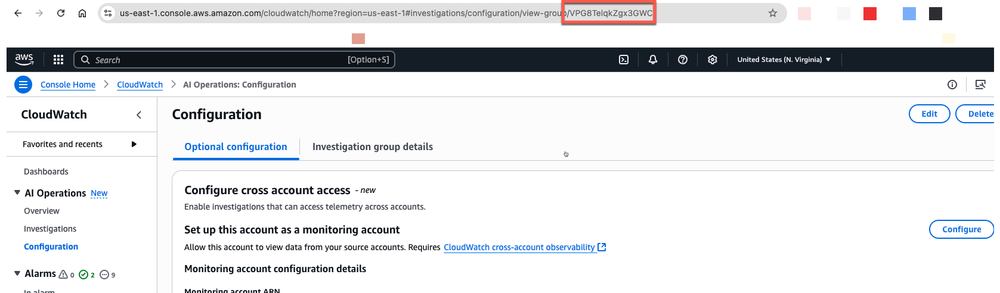

4. Configure Slack channel integration (Optional)
  
     - In the Chat client integration section, choose `Select SNS topic`.

   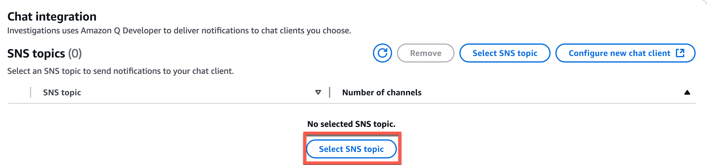

      - Select the `SNS topic` to use for sending notifications about your investigations.

   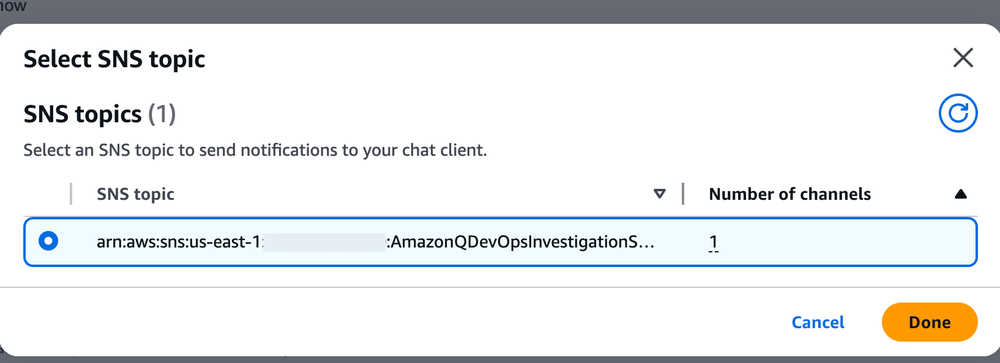

### Generate the errors

The `ControlLambdaServiceCont` provides functionality to start and stop error generation by invoking one or all of the three available AWS Lambdas every 1 minute through Amazon EventBridge rules, `WritingThrottlingLambda`, `ReadThrottlingErrorLambda`

#### Test Events

Pre-configured test events are available in `test-events/control-lambda-test-events.json`. These can be used either through the AWS Console or AWS CLI for testing the Control Lambda function.


#### Using AWS Lambda Console
To use the test events through the console:
1. Navigate to the `AWS Lambda`in the `AWS Console`
2. Select your Control Lambda function
3. Click on the `Test` tab
4. Click `Create new event`
5. Choose a template name (e.g., 'StartAllLambdas')
6. Copy one of the event objects from the test events file (e.g., the content of "StartAllLambdas")
     `{"action": "start"}`
      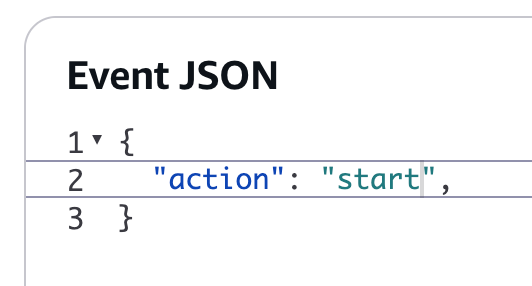
7. Click `Save` and run test event

#### Using AWS CLI
To invoke the Lambda function using the test events through AWS CLI:

1. First, get your Lambda function name (if you don't know it):
   ```bash
   aws lambda list-functions | grep ControlLambdaService
   ```

2. Execute the Lambda with a test event:
   ```bash
   # Using a test event directly
   aws lambda invoke \
     --function-name YOUR_CONTROL_LAMBDA_NAME \
     --cli-binary-format raw-in-base64-out \
     --payload '{"action": "start", "targetLambdas": ["WritingThrottlingLambda", "ReadThrottlingErrorLambda"]}' \
     response.json

   # Or using a test event from the JSON file
   aws lambda invoke \
     --function-name YOUR_CONTROL_LAMBDA_NAME \
     --cli-binary-format raw-in-base64-out \
     --payload "$(jq -c '.testEvents.StartAllLambdas' test-events/control-lambda-test-events.json)" \
     response.json
   ```

   The response will be saved in `response.json`. You can check the execution results with:
   ```bash
   cat response.json
   ```
Lambdas will be invoked, and after a couple minutes, CloudWatch Alarms will be in Alarm state and Investigations will be created in CloudWatch. 


*The above video has been edit, CloudWatch Investigations take time to analyse and propose suggestions and hypothesis*

### Manually Create Investigations
You can manually launch investigations from telemetry data (such as CloudWatch metrics, alarms, and logs)

1. Go to `CloudWatch` and start a new investigation by chosing one of the alarms, and clicking on `⋮` in any of the available alarms.

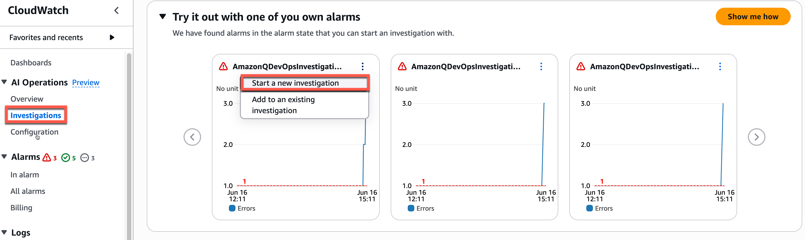

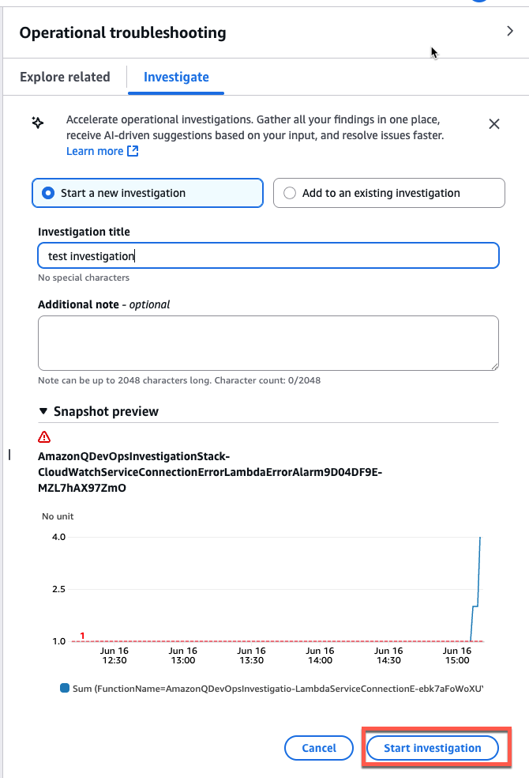

2. Under investigations, you should see your new `investigation group` and be able to access all the information

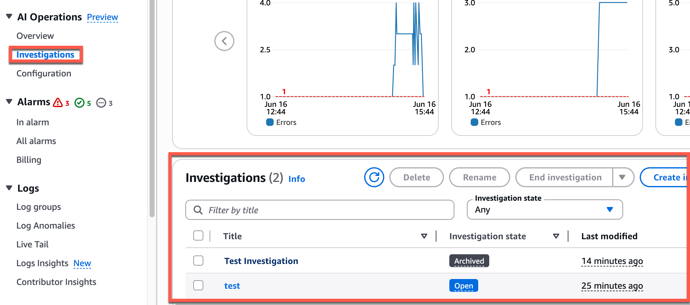

31. if you configured slack channel integration, the channel should receive messages of the new investigation *(optional)*

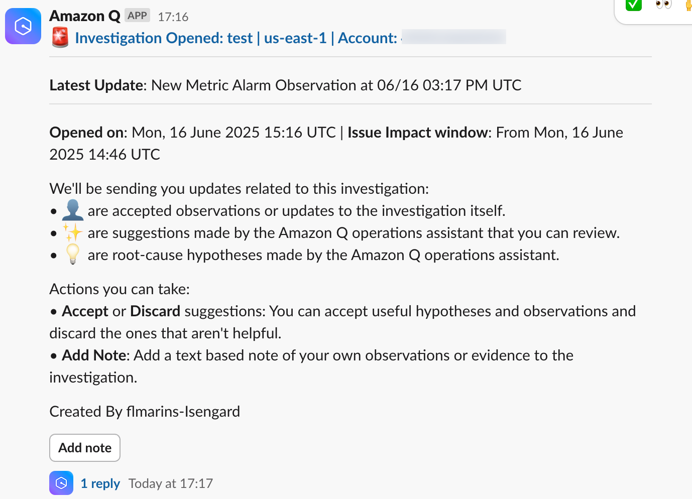
4. Under Investigations, choose `Create from log Insights` to add more information to the existing investigation

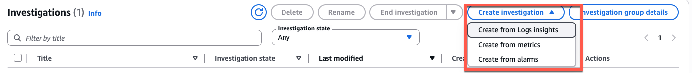

5. In the `Log Insights` query choose one of the existing lambda's log group

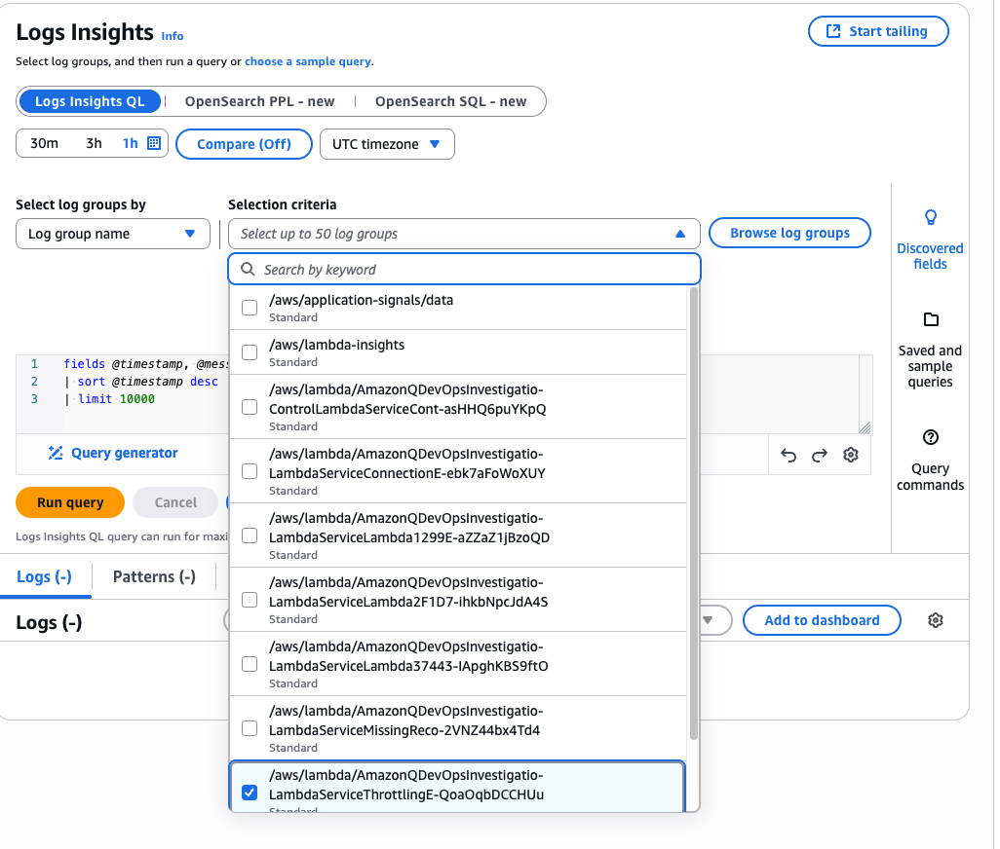

6. You should start seeing feedback from Amazon Q and suggestions, and be able to execute playbooks.
- Additional information from log and other metrics will be proposed to be used, you can either accept or refuse to further help the analysis


- If a possible solution is found, actions will be suggested


- Should you accept the hypothesis the playbook can be run

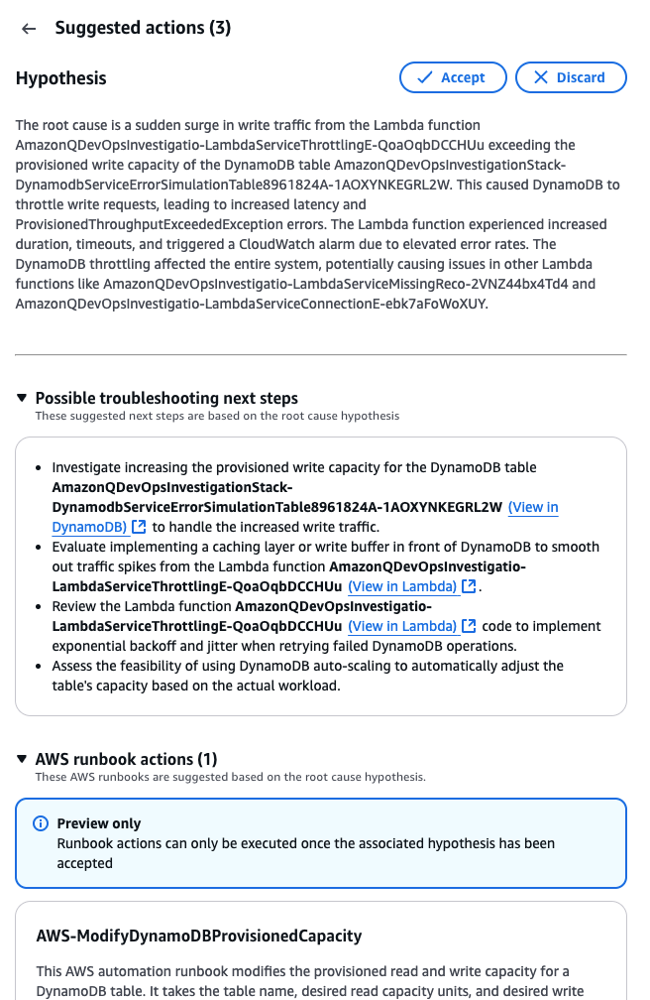

For additional information, please visit [CloudWatch investigations](https://docs.aws.amazon.com/AmazonCloudWatch/latest/monitoring/Investigations.html)


### **Clean Up**
To remove all deployed resources:
```bash
npx cdk destroy
```