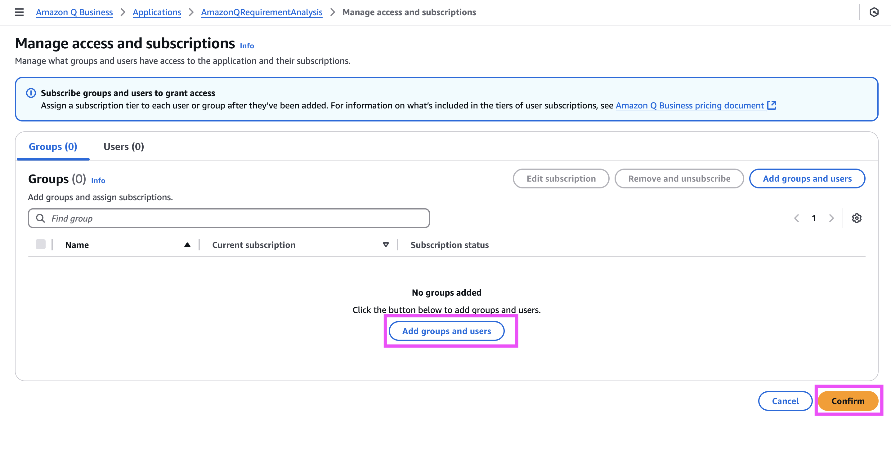
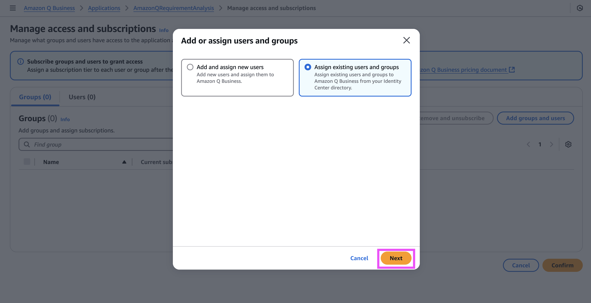
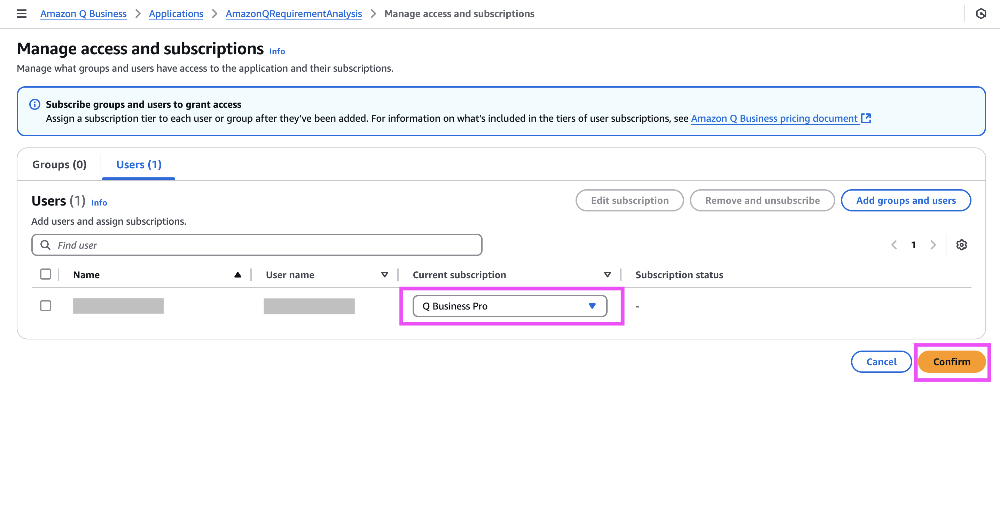
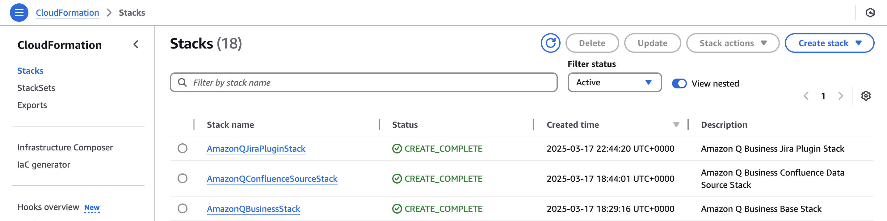

# Create epics, user stories and acceptance criteria for AnyCompanyReads from high level requirements

## 1. Introduction

AnyCompanyReads, a company that sells books globally from their physical stores wants to sell books online. The product owner has captured the high level requirements after discussing with business, UX, visual design and market research teams. Let's see how we can use Generative AI services on AWS to build the online book store - [AnyCompanyReads](https://catalog.workshops.aws/appsync-immersionday/en-US).


In this pattern, lets create a connection between Confluence (Cloud) and Amazon Q Business to read the high-level features and create epics, user stories and acceptance criteria in the Jira (Cloud)

Important: this application uses various AWS services and there are costs associated with these services after the Free Tier usage - please see the [AWS Pricing page](https://aws.amazon.com/pricing/) for details. You are responsible for any AWS costs incurred. No warranty is implied in this example.

## 2. Solution Architecture


## 3. Pre-requisites

### In Confluence Cloud:
* 	[Configure basic authentication](https://docs.aws.amazon.com/amazonq/latest/qbusiness-ug/confluence-cloud-credentials.html) credentials containing a username (email ID used to log into Confluence) and password ([Confluence API token](https://support.atlassian.com/atlassian-account/docs/manage-api-tokens-for-your-atlassian-account/#Create-an-API-token)) to allow Amazon Q to connect to your Confluence instance. 

Note: Amazon Q can also connect to your Confluence instance using [OAuth authentication](https://docs.aws.amazon.com/amazonq/latest/qbusiness-ug/confluence-cloud-credentials-oauth.html). 

### In Jira :
* Create Jira API token authentication credentials that include a Jira ID (email ID with domain) and a Jira credential ([Jira API token](https://support.atlassian.com/atlassian-account/docs/manage-api-tokens-for-your-atlassian-account/)). 
* Note the Jira account URL from your Jira account settings. For example, https://company.atlassian.net/.
* Note your Jira project key ID from your Jira project settings if you want to crawl only specific Jira projects.

Note: A step-by-step process of setting up basic authentication and retrieving the project key that is required by Amazon Q to connect to Jira is available in Amazon Q's official [documentation](https://docs.aws.amazon.com/amazonq/latest/qbusiness-ug/jira-credentials.html).

### In AWS console:
* [Create an AWS account](https://portal.aws.amazon.com/gp/aws/developer/registration/index.html) if you do not already have one and log in. The IAM user that you use must have sufficient permissions to make necessary AWS service calls and manage AWS resources.

*  Follow the steps below to [configure IAM Identity Center] (https://docs.aws.amazon.com/singlesignon/latest/userguide/what-is.html) for connecting your workforce users to AWS managed applications such as Amazon Q and other AWS resources. 
1. [Enable AWS IAM Identity Center](https://docs.aws.amazon.com/singlesignon/latest/userguide/enable-identity-center.html).
2. [Create a new user to your IAM Identity Center](https://docs.aws.amazon.com/singlesignon/latest/userguide/addusers.html). Make a note of the 
[Amazon Resource Name (ARN)](https://docs.aws.amazon.com/IAM/latest/UserGuide/reference_identifiers.html#identifiers-arns) associated with the IAM Identity Center.

### In your local terminal:
* [Install npm](https://docs.npmjs.com/downloading-and-installing-node-js-and-npm): The deployment will be done using AWS Cloud Deployment Kit (AWS CDK)](https://aws.amazon.com/cdk/). Therefore, install the Node Package Manager to install the CDK CLI.
* [AWS Cloud Development Kit (AWS CDK)](https://docs.aws.amazon.com/cdk/v2/guide/getting_started.html): Use the Node Package Manager to install the CDK CLI.
* Run the following commands after replacing the values in '<..>' with the actual values as described in the 'Notes' section below.

```
export APP_NAME=AmazonQRequirementAnalysis
export IDENTITY_CENTER_ARN=<identity-center-arn>
export CONFLUENCE_URL=<confluence-url>
export CONFLUENCE_USERNAME=<confluence-username>
export CONFLUENCE_PASSWORD=<confluence-password>
export JIRA_CLIENT_ID=<jira-client-id>
export JIRA_CLIENT_SECRET=<jira-client-secret>
export JIRA_REDIRECT_PATH=<jira-redirect-path>
export JIRA_URL=<jira-url>
export JIRA_AUTH_URL=<jira-auth-url>
export JIRA_ACCESS_TOKEN_URL=<jira-access-token-url>
```

Notes:
- `<identity-center-arn>`: Enter the ARN of the IAM Identity Center user created in the previous step.
- `<confluence-url>`: Enter the Confluence (Cloud) URL
- `<confluence-username>`: Enter the Confluence (Cloud) Username
- `<confluence-password>`: Enter the Confluence (Cloud) Password
- `<jira-client-id>`:  the client ID generated when you create the OAuth 2.0 application in Jira Cloud.
- `<jira-client-secret>`is the client secret generated when you create the OAuth 2.0 application in Jira Cloud.
- `<jira-redirect-path>` is the URL path to which user needs to be redirected after authentication, for instance `/oauth/callback`.
- `<jira-url>` enter the 'Jira URL along with the instance id' Eg: https://api.atlassian.com/ex/jira/<yourInstanceId>.
- `<jira-auth-url>`: For Jira Cloud OAuth applications, this is `https://auth.atlassian.com/authorize`.
- `<jira-access-token-url>`: For Jira Cloud OAuth applications, this is `https://auth.atlassian.com/oauth/token`.

## 4. Deployment instructions 

1. Run the following  commands from your local terminal to install the dependencies that your deployment requires. 

```
npm --prefix cdk install
npm --prefix ../../cdk-common install
```

2. Run the following command to check if your terminal is configured properly by validating your identity.

```
aws sts get-caller-identity
```

3. Create a role named `AmazonQBusiness-WebExperience-$APP_NAME` with the following trust policy.

```
cat << EOF > AmazonQBusinessWebExperience_trustPolicy.json
{
    "Version": "2012-10-17",
    "Statement": [
        {
            "Sid": "AmazonQBusinessTrustPolicy",
            "Effect": "Allow",
            "Principal": {
                "Service": "application.qbusiness.amazonaws.com"
            },
            "Action": [
                "sts:AssumeRole",
                "sts:SetContext"
            ]
        }
    ]
}
EOF

aws iam create-role --role-name AmazonQBusiness-WebExperience-${APP_NAME} \
    --assume-role-policy-document file://AmazonQBusinessWebExperience_trustPolicy.json

export AMAZON_Q_BUSINESS_WEB_ROLE=$(aws iam get-role --role-name AmazonQBusiness-WebExperience-${APP_NAME} --query Role.Arn --output text)
```

4. Change directory to the `cdk` folder

```
cd cdk
```

5. Before you deploy the stack into the AWS environment, the environment must first be bootstrapped. Run the following command to bootstrap  your AWS environment for usage with the AWS Cloud Development Kit (AWS CDK).

```
cdk bootstrap
```

6. Verify if your environment variables are properly configured.

```
echo ""
echo APP_NAME=$APP_NAME
echo AMAZON_Q_BUSINESS_WEB_ROLE=$AMAZON_Q_BUSINESS_WEB_ROLE
echo IDENTITY_CENTER_ARN=$IDENTITY_CENTER_ARN
echo CONFLUENCE_URL=$CONFLUENCE_URL
echo CONFLUENCE_USERNAME=$CONFLUENCE_USERNAME
echo CONFLUENCE_PASSWORD=$CONFLUENCE_PASSWORD
echo JIRA_CLIENT_ID=$JIRA_CLIENT_ID
echo JIRA_CLIENT_SECRET=$JIRA_CLIENT_SECRET
echo JIRA_REDIRECT_PATH=$JIRA_REDIRECT_PATH
echo JIRA_URL=$JIRA_URL
echo JIRA_AUTH_URL=$JIRA_AUTH_URL
echo JIRA_ACCESS_TOKEN_URL=$JIRA_ACCESS_TOKEN_URL
```

7. Run the following command to deploy the Amazon Q Business application named `AmazonQRequirementAnalysis`.

```
cdk deploy AmazonQBusinessStack --parameters AmazonQBusinessStack:appName=$APP_NAME \
    --parameters AmazonQBusinessStack:iamIdentityCenterArn=$IDENTITY_CENTER_ARN \
    --parameters AmazonQBusinessStack:qBusinessWebRoleArn=$AMAZON_Q_BUSINESS_WEB_ROLE
```

8. Run the following commands to connect a Confluence (Cloud) data source to the Amazon Q Business application.

```
cdk deploy AmazonQConfluenceSourceStack --parameters AmazonQConfluenceSourceStack:confluenceUrl=$CONFLUENCE_URL \
    --parameters AmazonQConfluenceSourceStack:confluenceUsername=$CONFLUENCE_USERNAME \
    --parameters AmazonQConfluenceSourceStack:confluencePassword=$CONFLUENCE_PASSWORD
```

9. You can view the CDK stacks that are deployed in [AWS Cloud Formation](https://console.aws.amazon.com/cloudformation/home).


### Integrating Amazon Q with Confluence

1. To start the Amazon Q Business Sync from the Confluence (Cloud) Data Source, navigate to the [Amazon Q Business Application](https://console.aws.amazon.com/amazonq/business/applications) and select the application named `AmazonQRequirementAnalysis`. In the Application Details page, on the side bar select `Data Sources` and then `Sync Now`.

Note: After the data source is created, the sync will commence. Based on the number of documents to index, the time will vary. Once the sync is completed, success/failures will be reported with a detailed link to Amazon CloudWatch.
In the current example, the Data Sources sync is configured "On-demand". _[Click here to learn about all the available options](https://docs.aws.amazon.com/amazonq/latest/qbusiness-ug/connector-concepts.html#connector-sync-run)_.


2. To configure access to your Amazon Q Business Application, click the application name **AmazonQRequirementAnalysis* from the left navigation bar. Navigate to the application details page select `Manager User Access`.


* Click `Add groups and users` and `Confirm`.



* Click `Assign existing users and groups` and `Next`.



* In the next screen, search for the user that was created in the pre-requisites section and click `Assign`.


* In the confirmation screen, confirm that Amazon Q Business Pro license subscription is selected in the drop down. Click `Confirm`.




### Integrating Amazon Q with Jira 

1. In Jira, update [OAuth 2.0](https://developer.atlassian.com/cloud/jira/platform/oauth-2-3lo-apps/) app with the Amazon Q callback URL.


Note: The Callback URL is the Amazon Q Business Application deployed URL followed by `/oauth/callback`.

2. Run the following command in your local terminal to connect the Jira plugin to Amazon Q Business application.
```
cdk deploy AmazonQJiraPluginStack --parameters AmazonQJiraPluginStack:jiraClientId=$JIRA_CLIENT_ID \
    --parameters AmazonQJiraPluginStack:jiraClientSecret=$JIRA_CLIENT_SECRET \
    --parameters AmazonQJiraPluginStack:jiraRedirectPath=$JIRA_REDIRECT_PATH \
    --parameters AmazonQJiraPluginStack:jiraUrl=$JIRA_URL \
    --parameters AmazonQJiraPluginStack:jiraAuthUrl=$JIRA_AUTH_URL \
    --parameters AmazonQJiraPluginStack:jiraAccessTokenUrl=$JIRA_ACCESS_TOKEN_URL
```

3. You can view the CDK stack that is deployed in [AWS Cloud Formation](https://console.aws.amazon.com/cloudformation/home).



## 5. Test

1. Navigate to the [Amazon Q Business Application](https://console.aws.amazon.com/amazonq/business/applications) and select the application named `AmazonQRequirementAnalysis`.
2. Click on the application name from the left navigation bar. 
3. Click on the `Deployed URL` link.
4. Enter the `username` and `password` created in the pre-requisites section 
5. In the chat window that appears, provide prompts to generate epics. 
Note: Amazon Q has indexed the Confluence pages which has a high level requirements and high level technical design of AnyCompanyReads, along with Agile practices followed in the organization. With those details, Amazon Q will provide the list of epics.


6. Next prompt Amazon Q to generate user stories.


7. Scrum masters can leverage Amazon Q to assign story points. Amazon Q can provide suggestions based on the complexity.


8. You can keep providing more prompts, if you aren't satisfied with what Amazon Q has generated. Otherwise, you can move to the next step of creating the epics and user stories in Jira for AnyCompanyReads book store application.

9. Click on the 'Plugin' button and clicking on 'Jira Cloud' in the chat window and prompt Amazon Q to create issues in Jira for the epics.


10. Amazon Q will ask you for the project key. Enter the project key for the Jira project that you created in Jira Cloud.


11. After you enter the project key, Amazon Q will give you a preview of the issue to make changes if any. If you are satisfied, then click on 'Submit'.Amazon Q will ask you to authorize the connection to Jira.


12. Once authorized, you will see that Amazon Q creates the epics in Jira and gives a summary of the epics created.


13. Next lets leverage Amazon Q to create user stories for the epics. Prompt Amazon Q to create stories with acceptance criteria. Amazon Q will give you a preview of the issue to make changes if any. If you are satisfied, then click on 'Submit'.


Note: Login to Jira and check the epics and user stories created for AnyCompanyReads application.

## 6. Clean up

Move to the `cdk` folder

```
cd cdk
```
Run the following command to destroy the Amazon Q Application

```
cdk destroy --all
```

Finally remove the iam role `AmazonQBusiness-WebExperience-${APP_NAME}`

```
aws iam delete-role --role-name AmazonQBusiness-WebExperience-${APP_NAME}
```

## 7. Security

_See CONTRIBUTING for more information._

## 8. License

_This library is licensed under the MIT-0 License. See the LICENSE file._

## 9. Disclaimer

_"The solution architecture sample code is provided without any guarantees, and you're not recommended to use it for production-grade workloads. The intention is to provide content to build and learn. Be sure of reading the licensing terms."_