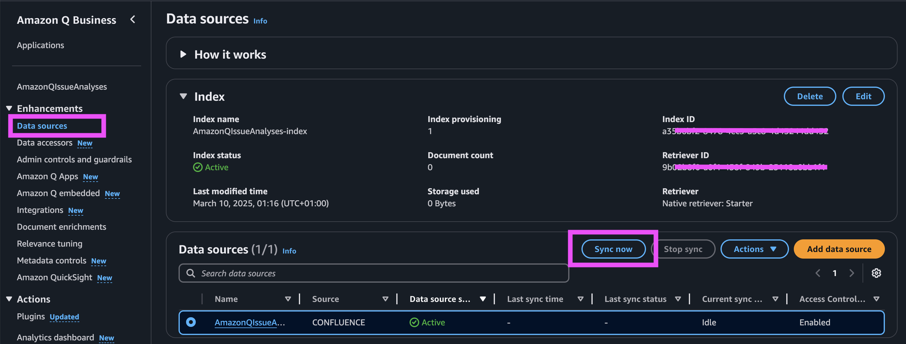
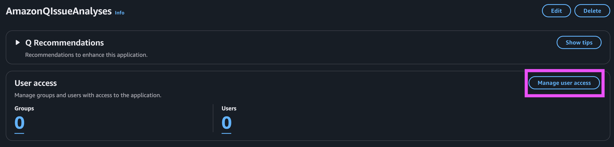
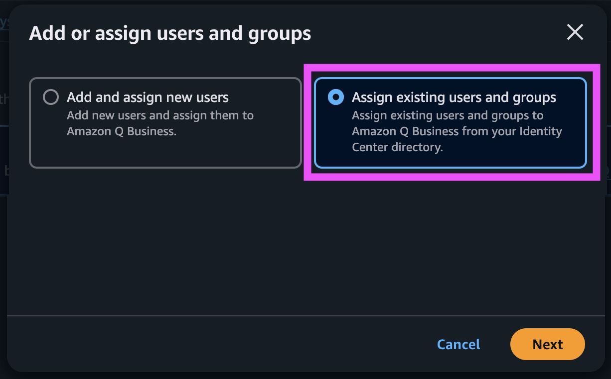
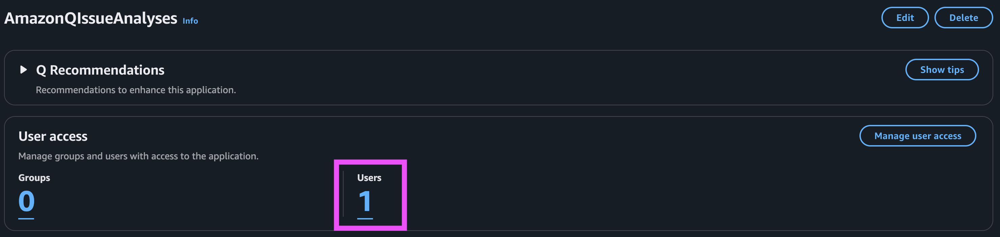
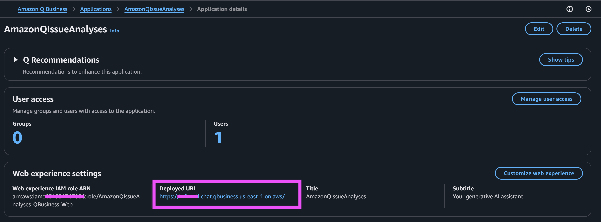

# Knowledge Management and search your internal documents

## 1. Introduction
A robust Knowledge Management application enables organizations to efficiently store, organize, and retrieve critical business information.

AnyCompanyReads wants to build a Knowledge Management application that will serve as a centralized platform to retrieve information and documents throughout the software development lifecycle (SDLC) process. The solution will help teams access relevant documents, best practices, and technical information quickly and efficiently. This will improve team productivity, reduce redundant work, and ensure consistent knowledge sharing across the organization.

## 2. Key Use-Cases
The solution can be beneficial throughout multiple phases of the SDLC. Here’s a breakdown of how it can be used and the benefits it provides in each phase:

* <B>Requirements Gathering</B> : During the requirements gathering phase, a project manager can utilize the knowledge base to access historical project data, previous requirements documents, and stakeholder feedback. This helps in setting realistic project timelines, understanding potential risks, and ensuring that all necessary stakeholders are involved from the outset. The knowledge base can also provide templates for requirement documentation, which streamlines the process and ensures consistency across projects.
Business users can benefit from the knowledge base by reviewing past project case studies and requirement specifications. This allows them to better articulate their needs and understand what is feasible within the given constraints. Additionally, they can access user stories and use cases from previous projects to help frame their own requirements more effectively.

* <B> Design </B>: In the design phase, a solution architect can leverage the knowledge base to review architectural patterns, design decisions, and technology stack choices from previous projects. This aids in making informed decisions about the system’s architecture, ensuring it aligns with both business requirements and technical constraints. The knowledge base may also contain guidelines and best practices for design principles, which help in creating a robust and scalable solution.
Developers can use the knowledge base to understand the architectural decisions made in previous projects, which helps them align their coding practices with the overall design. They can also access code snippets, design documents, and API specifications, which accelerates the development process and ensures consistency across the team.

* <B>Implementation</B> : During implementation, developers can refer to the knowledge base for coding standards, style guides, and best practices. This ensures that the code is maintainable, readable, and adheres to the company’s quality standards. The knowledge base may also contain troubleshooting guides and FAQs, which help developers resolve common issues quickly.
QA engineers can benefit from the knowledge base by accessing test plans, test cases, and bug reports from previous projects. This helps them create comprehensive test strategies and identify potential areas of risk early in the development cycle. The knowledge base may also contain automation scripts and testing tools documentation, which can be reused to save time and effort.

* <B>Testing</B>: In the testing phase, QA engineers can use the knowledge base to review past test results, common defects, and resolution strategies. This helps in creating more effective test cases and identifying patterns in defects that may indicate deeper issues in the code or design. The knowledge base can also provide insights into performance benchmarks and security standards, ensuring that the software meets all necessary criteria.
Developers can use feedback from the knowledge base to understand common issues that arise during testing, allowing them to write more robust code and conduct peer reviews more effectively. This iterative learning process helps in improving the overall quality of the software.

* <B>Deployment</B> : During deployment, a DevOps engineer can refer to the knowledge base for deployment checklists, rollback procedures, and post-deployment monitoring strategies. This ensures a smooth transition from development to production and helps in quickly addressing any issues that arise after deployment.
Business users can benefit from the knowledge base by understanding the deployment process and what to expect post-launch. This helps in setting realistic expectations and preparing for any necessary training or change management activities.


* <B>Maintenance</B> : Support Engineers can utilize the internal knowledge base to quickly resolve user issues and perform maintenance tasks. It provides them with troubleshooting guides, FAQs, and known issue documentation. The knowledge base also offers insights into common user queries and their resolutions, enabling Support Engineers to provide timely and effective assistance to end-users.

This will help to achieve productivity improvements. Some of these improvements are listed below:-

* Onboarding New Developers: New team members can quickly get up to speed by accessing documented processes, coding standards, and project-specific knowledge.
* Faster Response to Customers: With readily available documentation and historical data, the team can provide quicker responses to customer inquiries and issues.
* Knowledge Retention: Ensures that institutional knowledge is retained even if team members leave, reducing the risk of knowledge loss.
* Consistency and Quality: Promotes adherence to best practices and standards across the project, leading to higher-quality deliverables.
* Reduced Redundancy: Minimizes the duplication of efforts by leveraging existing solutions and documentation.


In this pattern, we will create a Knowledge Management application using Amazon Q to search information from Confluence (Cloud) and Jira (Cloud).

Important: this application uses various AWS services and there are costs associated with these services after the Free Tier usage - please see the [AWS Pricing page](https://aws.amazon.com/pricing/) for details. You are responsible for any AWS costs incurred. No warranty is implied in this example.

## 3. Solution Architecture 


1. The project team is connecting to Amazon Q to retrieve all the information that are available on Confluence and Jira.
2. Amazon Q Business perform a search based on the query.
3. Amazon Q retrieve all relevant information from the Amazon Q Data Sources.
3. The Project team  get requested information which helps them to take decision for example service details to develop a feature, function requirement, acceptance criteria of a user storty etc.
4. The Amazon Q App “Jira Ticket Analyzer” retrieve the details information from Jira, create a summary of all information integrating the data coming from Amazon Q Data Sources. The Jira Ticket Analyzer also provide possible solutions and best next action to help the Project Manager to unblock the development.
5. Amazon Q retrieve all relevant information from the Amazon Q Data Sources 

## 4. Prerequisites

In this section you will execute the required step to install the solution in your AWS account. To proceed with the installation, you will need:
- [npm](https://docs.npmjs.com/downloading-and-installing-node-js-and-npm): the standard package manager for Node.js.
- [AWS Cloud Development Kit (AWS CDK)](https://docs.aws.amazon.com/cdk/v2/guide/getting_started.html): to execute the scrip to create the environment in your AWS account 
- [AWS Account](https://aws.amazon.com/resources/create-account/): to create the required environment
- [AWS Command Line Interface (AWS CLI)](https://docs.aws.amazon.com/cli/latest/userguide/getting-started-quickstart.html): to run the AWS CDK command from your terminal
- [Confluence Cloud](https://developer.atlassian.com/cloud/confluence/): to connect Cloud Cloud as Amazon Q Business data source
- [Jira Cloud](https://developer.atlassian.com/cloud/jira/platform/): to connect Jira as Amazon Q Business plugin

### npm - Setup

To publish and install packages to and from the public npm registry or a private npm registry, you must install Node.js and the npm command line interface using either a Node version manager or a Node installer. [To get started follow this documentation](https://docs.npmjs.com/downloading-and-installing-node-js-and-npm).

### AWS Cloud Development Kit (AWS CDK) - Setup

Get started with the AWS Cloud Development Kit (AWS CDK) by installing and configuring the AWS CDK Command Line Interface (AWS CDK CLI). Then, use the CDK CLI to create your first CDK app, bootstrap your AWS environment, and deploy your application. [To get started follow this documentation](https://docs.aws.amazon.com/cdk/v2/guide/getting_started.html).

### AWS Account - Setup

[Create an AWS account](https://portal.aws.amazon.com/gp/aws/developer/registration/index.html) if you do not already have one and log in. The IAM user that you use must have sufficient permissions to make necessary AWS service calls and manage AWS resources. 
Setup the [AWS IAM Identity Center](https://docs.aws.amazon.com/singlesignon/latest/userguide/what-is.html) for connecting your workforce users to AWS managed applications such as Amazon Q Developer and Amazon QuickSight, and other AWS resources.

To setup your AWS IAM Identity Center follow these steps

1. [Enable AWS IAM Identity Center](https://docs.aws.amazon.com/singlesignon/latest/userguide/enable-identity-center.html).
2. [Create a new user to your IAM Identity Center](https://docs.aws.amazon.com/singlesignon/latest/userguide/addusers.html).
3. Make a note of the 
[Amazon Resource Name (ARN)](https://docs.aws.amazon.com/IAM/latest/UserGuide/reference_identifiers.html#identifiers-arns) associated with the IAM Identity Center.

Run the command in your terminal by replacing the variable with the value as described in the note below.

```
export APP_NAME=AmazonQIssueAnalyses
export IDENTITY_CENTER_ARN=<identity-center-arn>
```

__Note:__
- `<identity-center-arn>`: Enter the ARN of the IAM Identity Center user created in the previous step.
- `AmazonQIssueAnalyses` is the default name of the Amazon Q Business Application that can be customized. 


### Confluence (Cloud) - Amazon Q Business Data Source Setup

Before you connect Confluence (Cloud) to Amazon Q Business, you need to create and retrieve the Confluence (Cloud) credentials you will use to connect Confluence (Cloud) to Amazon Q. You will also need to add any permissions needed by Confluence (Cloud) to connect to Amazon Q. For this example, we will leverage Confluence (Cloud) basic authentication. [Check the documentation on how to configure Confluence (Cloud) basic authentication](https://docs.aws.amazon.com/amazonq/latest/qbusiness-ug/confluence-cloud-credentials-basic.html)

__Note:__ Check the documentation for an [overview on how you could authenticated to Confluence (Cloud) from Amazon Q](https://docs.aws.amazon.com/amazonq/latest/qbusiness-ug/confluence-cloud-credentials.html).

Run the command in your terminal by replacing the variables with the values as described in the note below.

```
export CONFLUENCE_URL=<confluence-url>
export CONFLUENCE_USERNAME=<confluence-username>
export CONFLUENCE_PASSWORD=<confluence-password>
```

__Note:__
- `<confluence-url>`: Enter the Confluence (Cloud) URL
- `<confluence-username>`: Enter the Confluence (Cloud) Username
- `<confluence-password>`: Enter the Confluence (Cloud) Password


### Jira Cloud - Amazon Q Business Plugin Setup

Jira Cloud is a project management tool that creates issues (tickets) for software development, product management, and bug tracking. If you’re a Jira Cloud user, you can create an Amazon Q Business plugin to allow your end users to perform actions within their web experience chat.
To setup the Jira Cloud Amazon Q Business Plugin follow [the prerequisites described in the documentation](https://docs.aws.amazon.com/amazonq/latest/qbusiness-ug/jira-actions.html#jira-plugin-prereqs).

Run the command in your terminal by replacing the variables with the values as described in the note below.

```
export JIRA_CLIENT_ID=<jira-client-id>
export JIRA_CLIENT_SECRET=<jira-client-secret>
export JIRA_REDIRECT_PATH=<jira-redirect-path>
export JIRA_URL=<jira-url>
export JIRA_AUTH_URL=<jira-auth-url>
export JIRA_ACCESS_TOKEN_URL=<jira-access-token-url>
```

__Note:__
The `<jira-client-id>` and the `<jira-client-secret>` are available in your OAuth 2.0 App after that you configure the the Jira Callback URL. The callback URL will be available after deploying the `AmazonQBusinessStack` stack, in the next steps.

__Note:__
- `<jira-client-id>`:  the client ID generated when you create the OAuth 2.0 application in Jira Cloud.
- `<jira-client-secret>`is the client secret generated when you create the OAuth 2.0 application in Jira Cloud.
- `<jira-redirect-path>` is the URL path to which user needs to be redirected after authentication, for instance `/oauth/callback`.
- `<jira-url>` enter the 'Jira URL along with the instance id' Eg: https://api.atlassian.com/ex/jira/<yourInstanceId>.
- `<jira-auth-url>`: For Jira Cloud OAuth applications, this is `https://auth.atlassian.com/authorize`.
- `<jira-access-token-url>`: For Jira Cloud OAuth applications, this is `https://auth.atlassian.com/oauth/token`.

## 5. Deployment instructions

In this section you will deploy Amazon Q Business and the required environment. We will perform the following steps:
- Deploy the infrastructure with AWS CDK
- Configure the Amazon Q Business Access
- Enable the Amazon Q Business Data Sync
- Create the Amazon Q App

### Deploy the infrastructure with AWS CDK

Run the following command to install the required dependencies in the current [cdk project](./cdk/) and the [cdk library inside the cdk-common](//cdk-common) folder: 

```
npm --prefix cdk install
npm --prefix ../../../cdk-common install
```

Verify your that you terminal is correctly configured with AWS CLI and verify your current identity by running the following command.

```
aws sts get-caller-identity
```

Create the required `QBusiness-WebExperience-$APP_NAME` role with the following trust policy.

```
cat << EOF > QBusinessWebExperience_trustPolicy.json
{
    "Version": "2012-10-17",
    "Statement": [
        {
            "Sid": "QBusinessTrustPolicy",
            "Effect": "Allow",
            "Principal": {
                "Service": "application.qbusiness.amazonaws.com"
            },
            "Action": [
                "sts:AssumeRole",
                "sts:SetContext"
            ]
        }
    ]
}
EOF

aws iam create-role --role-name QBusiness-WebExperience-${APP_NAME} \
    --assume-role-policy-document file://QBusinessWebExperience_trustPolicy.json

export Q_BUSINESS_WEB_ROLE=$(aws iam get-role --role-name QBusiness-WebExperience-${APP_NAME} --query Role.Arn --output text)
```

Move to the `cdk` folder

```
cd cdk
```

Run the following command Bootstrapping is the process of preparing your AWS environment for usage with the AWS Cloud Development Kit (AWS CDK). Before you deploy a CDK stack into an AWS environment, the environment must first be bootstrapped.

```
cdk bootstrap
```

Verify that all the current environment variables are properly configured

```
echo ""
echo APP_NAME=$APP_NAME
echo Q_BUSINESS_WEB_ROLE=$Q_BUSINESS_WEB_ROLE
echo IDENTITY_CENTER_ARN=$IDENTITY_CENTER_ARN
echo CONFLUENCE_URL=$CONFLUENCE_URL
echo CONFLUENCE_USERNAME=$CONFLUENCE_USERNAME
echo CONFLUENCE_PASSWORD=$CONFLUENCE_PASSWORD
echo JIRA_CLIENT_ID=$JIRA_CLIENT_ID
echo JIRA_CLIENT_SECRET=$JIRA_CLIENT_SECRET
echo JIRA_REDIRECT_PATH=$JIRA_REDIRECT_PATH
echo JIRA_URL=$JIRA_URL
echo JIRA_AUTH_URL=$JIRA_AUTH_URL
echo JIRA_ACCESS_TOKEN_URL=$JIRA_ACCESS_TOKEN_URL
```

Run the following commands to deploy the Amazon Q Business application named `AmazonQIssueAnalyses`. the CDK will need to be deployed sequentially.

```
cdk deploy AmazonQBusinessStack --parameters AmazonQBusinessStack:appName=$APP_NAME \
    --parameters AmazonQBusinessStack:iamIdentityCenterArn=$IDENTITY_CENTER_ARN \
    --parameters AmazonQBusinessStack:qBusinessWebRoleArn=$Q_BUSINESS_WEB_ROLE
```

Run the following commands to connect a Confluence (Cloud) data source to the Amazon Q Business application.

```
cdk deploy AmazonQConfluenceSourceStack --parameters AmazonQConfluenceSourceStack:confluenceUrl=$CONFLUENCE_URL \
    --parameters AmazonQConfluenceSourceStack:confluenceUsername=$CONFLUENCE_USERNAME \
    --parameters AmazonQConfluenceSourceStack:confluencePassword=$CONFLUENCE_PASSWORD
```

Once all the AWS CDK are deployed, in [AWS Cloud Formation](https://console.aws.amazon.com/cloudformation/home) you will see the following Stacks.


### Enable the Amazon Q Business Sync from Confluence Data Sources

To start the Amazon Q Business Sync from the Confluence (Cloud) Data Source, navigate to the [Amazon Q Business Application](https://console.aws.amazon.com/amazonq/business/applications) and select the application named **AmazonQIssueAnalyses**. In the Application Details page, on the side bar select `Data Sources` and then `Sync Now`.

**Note**: _in the current example the Data Sources sync is configured "on-demand", however [here you can find all the available options](https://docs.aws.amazon.com/amazonq/latest/qbusiness-ug/connector-concepts.html#connector-sync-run)._



### Configure the Amazon Q Business Access

To configure the access to your Amazon Q Business Application navigate to the [Amazon Q Business Application](https://console.aws.amazon.com/amazonq/business/applications) and select the application named **AmazonQIssueAnalyses**. In application details page select **Manager User Access**.



Assigned existing users and groups like show below.



Search and select the user that you would like to assign to the **AmazonQIssueAnalyses** Amazon Q Business Application.


Confirm the Amazon Q Business Pro license subscription to have the full experience and leveraging [Amazon Q Apps](https://aws.amazon.com/blogs/aws/amazon-q-apps-now-generally-available-enables-users-to-build-their-own-generative-ai-apps/).

**Note**: _More information on the [Amazon Q Business Pricing can be found here](https://aws.amazon.com/q/business/pricing/)_


You can review the subscribed user in the screen below.



Now you can access your Amazon Q Business Application by selecting the **Deployed URL**.



After login to the Amazon Q Business Application, with the IAM Identity Center that was subscribed to the Amazon Q Business, you will be able to ask questions that will also involved the information coming from Confluence Cloud. 

### Configure Amazon Q Plugin for Jira 

Before you can leverage the [Amazon Q Plugin for Jira](https://docs.aws.amazon.com/amazonq/latest/qbusiness-ug/jira-actions.html), you will need to update the OAuth 2.0 Jira Cloud app with the Callback URL, as you can see in the image below. [More information can be found here](https://developer.atlassian.com/cloud/jira/platform/oauth-2-3lo-apps/). 


After you complete the Jira setup, run the following command to connect the Jira plugin to the Amazon Q Business application.

```
cdk deploy AmazonQJiraPluginStack --parameters AmazonQJiraPluginStack:jiraClientId=$JIRA_CLIENT_ID \
    --parameters AmazonQJiraPluginStack:jiraClientSecret=$JIRA_CLIENT_SECRET \
    --parameters AmazonQJiraPluginStack:jiraRedirectPath=$JIRA_REDIRECT_PATH \
    --parameters AmazonQJiraPluginStack:jiraUrl=$JIRA_URL \
    --parameters AmazonQJiraPluginStack:jiraAuthUrl=$JIRA_AUTH_URL \
    --parameters AmazonQJiraPluginStack:jiraAccessTokenUrl=$JIRA_ACCESS_TOKEN_URL
```

Once the deployment is completed, the `AmazonQJiraPluginStack` stack will be visible Cloud Formation.


After the configuration is completed, you can access Amazon Q Business Application and interact with Jira Plugin. 

**Note:** _Before been able to use the integration, Amazon Q Business will ask yuo to authenticate with the OAuth 2.0 Jira Cloud app._


## 6. Test

In this walkthrough, we utilize the default settings and select View web experience to be redirected to the Amazon Q application's login page.

Log in to the application with the user credentials that were added to the Amazon Q application. Upon successful login, you will be redirected to the Amazon Q assistant UI, where you can ask questions in natural language and obtain insights from your Confluence and Jira.

You can customize the Title, Subtitle, and Welcome message fields according to your needs, which will be reflected in the UI.


### Search information/documents available in Confluence Cloud:

The Confluence data source connected to this Amazon Q application contains documents related to the AnyBookReads project, including the High Level Requirements document, Feature Capability documents, and Reports. We show how the Amazon Q application allows you to ask questions about documents within this project using natural language and obtain responses and insights for those queries.


Let’s begin by asking Amazon Q to provide a List top three top spending cutomer as per report. The following screenshot displays the response, listing the top three top spending cutomer as per report documemt. The response also includes Sources, which contain links to all the matching documents. Choosing any of those links will redirect you to the corresponding Confluence page links.


For the second query, we ask Amazon Q list all AWS services mentioned in 'Admin Panel' feature. The following screenshot displays the response, which includes a summary of AWS services.


Lets ask functional requirements of 'E-commerce' feature.The following screenshot displays the response.


### Search information/documents available in Jira Cloud:

The Jira data source connect to this Amazon Q application includes the AnyBookReads project, which contains tasks associated with the project sprint, user stories, and related issues. We show how the Amazon Q application allows you to ask questions using natural language and obtain responses and insights for those queries.

Let’s begin by asking Amazon Q to provide acceptance criteria of 'View the list books that are available to browse in AnyCompany Reads' user story. The following screenshot displays the response, listing the cceptance criteria of order a book user story. The response also includes Sources, which contain links to all the matching documents. Choosing any of those links will redirect you to the corresponding Confluence page with the relevant document.


Lets ask the details of 'Retrieve my account even when I forget my password' user story.The following screenshot displays the response.


## 7. Clean up

Move to the `cdk` folder

```
cd cdk
```
Run the following command to destroy the Amazon Q Application

```
cdk destroy --all
```

Finally remove the iam role `QBusiness-WebExperience-${APP_NAME}`

```
aws iam delete-role --role-name QBusiness-WebExperience-${APP_NAME}
```

## 8. Security

_See CONTRIBUTING for more information._

## 9. License

_This library is licensed under the MIT-0 License. See the LICENSE file._

## 10. Disclaimer

_"The solution architecture sample code is provided without any guarantees, and you're not recommended to use it for production-grade workloads. The intention is to provide content to build and learn. Be sure of reading the licensing terms."
