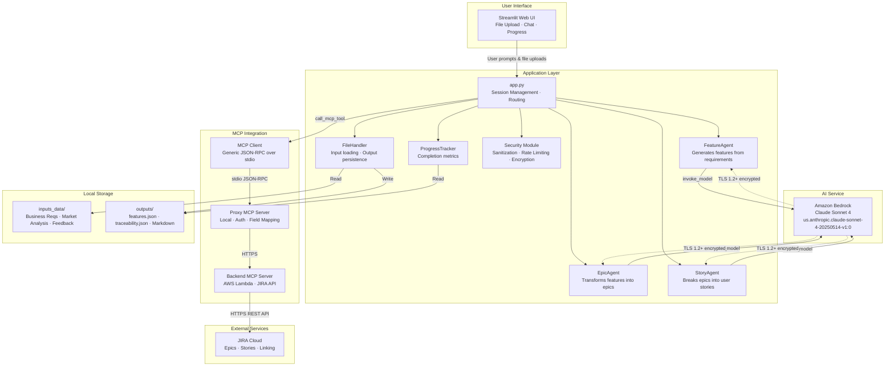
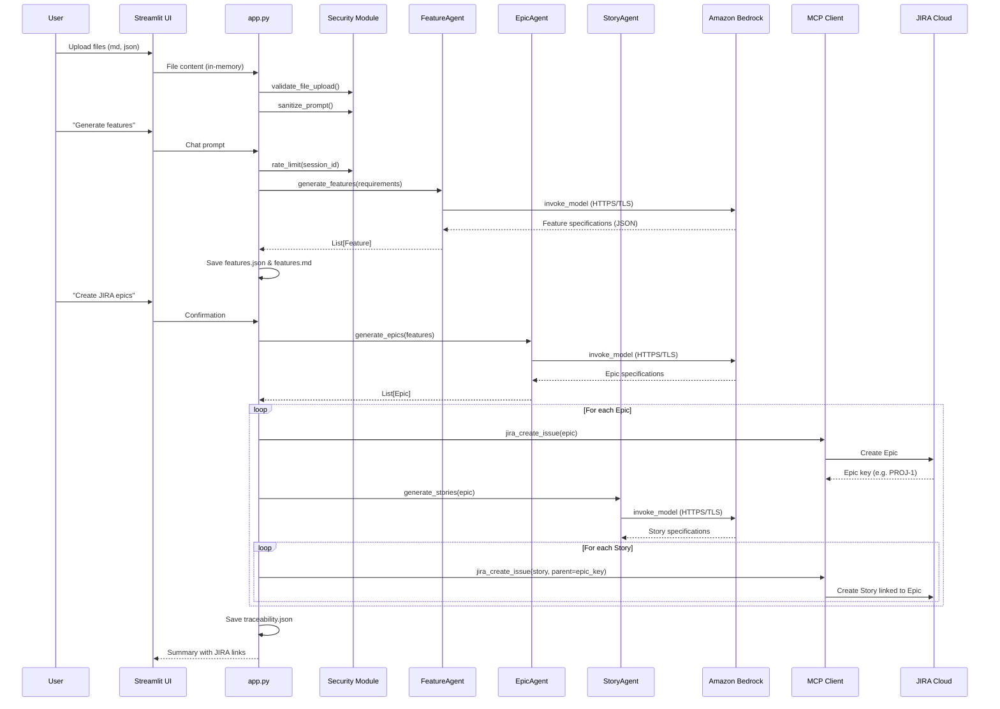

# Architecture

## System Architecture Diagram

## Data Flow

## Component Responsibilities

| Component | Responsibility | Security Controls |
|-----------|---------------|-------------------|
| app.py | Session management, routing, orchestration | Rate limiting, input validation |
| FeatureAgent | Generate features from business requirements | Input sanitization before prompt construction |
| EpicAgent | Transform features into epic specifications | Input sanitization, template injection prevention |
| StoryAgent | Break epics into user stories | Input sanitization, template injection prevention |
| FileHandler | Read inputs, write outputs with path validation | Path traversal prevention, symlink rejection, size limits |
| Security Module | Centralized security utilities | Fernet encryption, rate limiting, prompt sanitization |
| MCP Client | Generic JSON-RPC communication over stdio | Path validation, subprocess hardening |
| ProgressTracker | Calculate completion metrics from traceability data | Read-only operations, error handling |

## Trust Boundaries

1. **User → Application**: All user input (file uploads, chat prompts) passes through `sanitize_prompt()`, `validate_file_upload()`, and `rate_limit()` before processing.
2. **Application → Amazon Bedrock**: Communication over HTTPS/TLS (managed by boto3). IAM credentials required.
3. **Application → MCP Server**: Local subprocess communication via stdio. Script path validated and resolved before execution.
4. **MCP Proxy → Backend**: HTTPS communication to AWS Lambda.
5. **Backend → JIRA Cloud**: HTTPS REST API with OAuth authentication managed by the MCP server layer.
