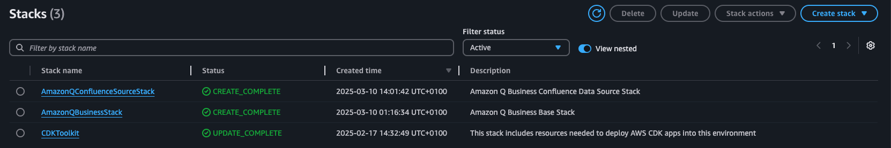
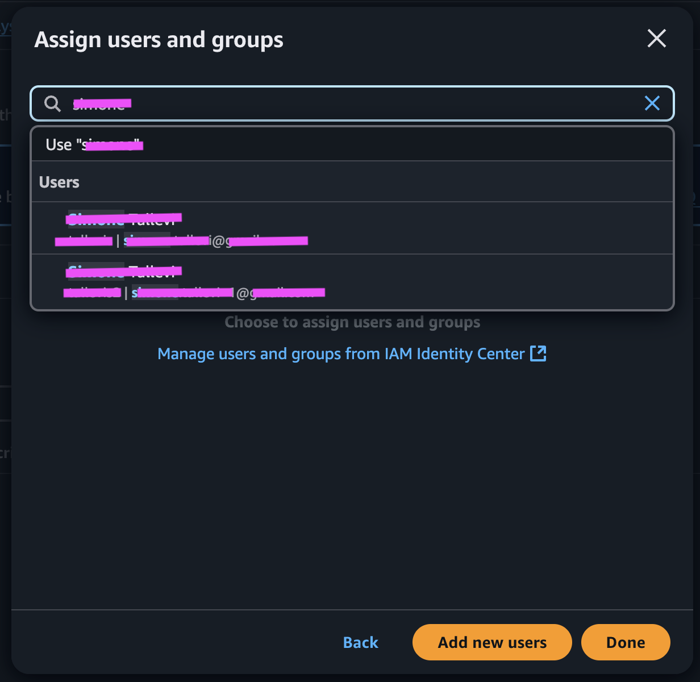
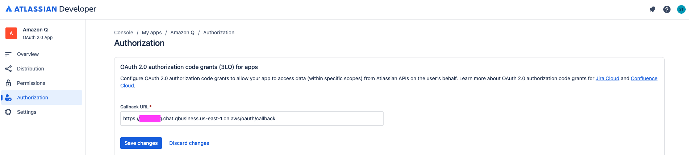
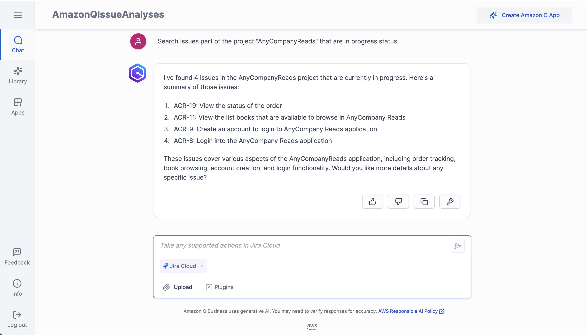
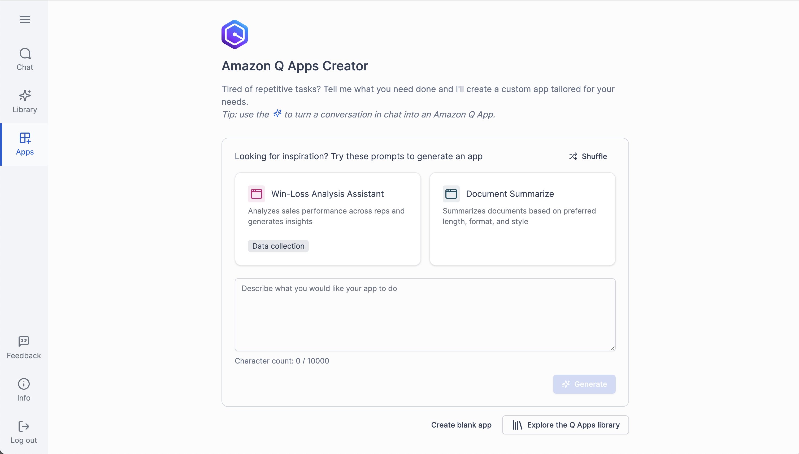
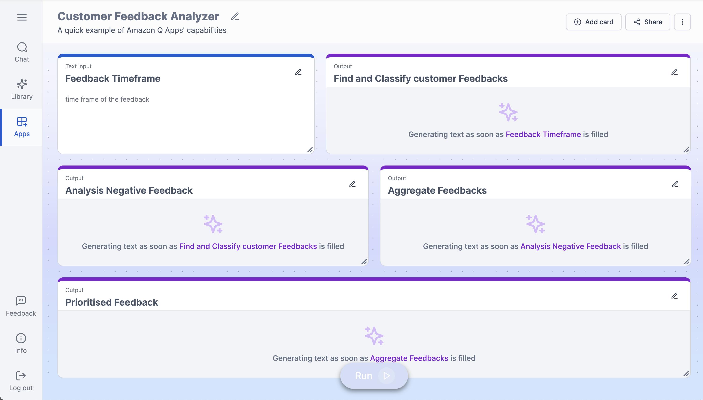
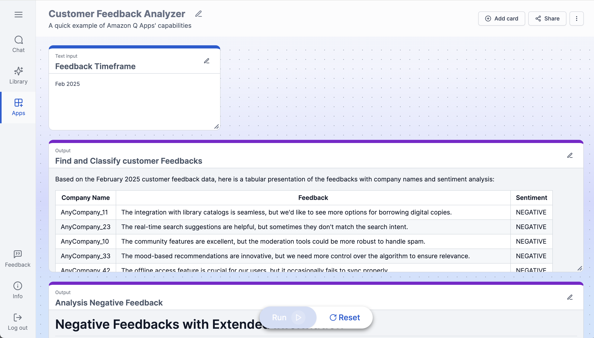
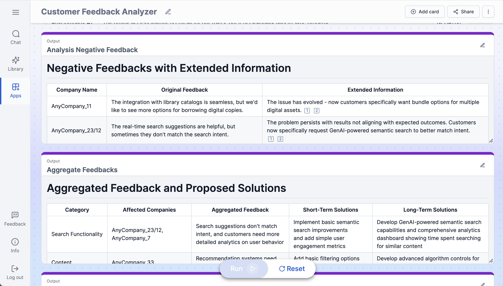
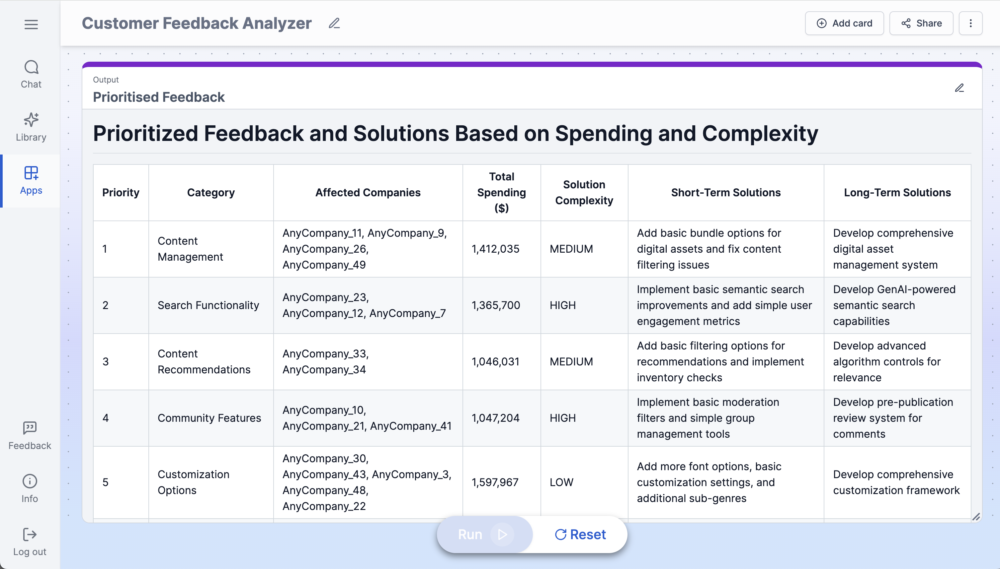

# Customer Feedback Analysis

## Introduction

AnyCompanyReads, a company that sells books globally from their physical stores wants to sell books online. The product owner has captured the high-level requirements after discussing with business, UX, visual design and market research teams. Let's see how we can use Generative AI services on AWS to build the online book store - [AnyCompanyReads](https://catalog.workshops.aws/appsync-immersionday/en-US).

In this project we are going to explorer how Project managers can leverage Amazon Q Business to analyze customers feedback, to address issues impacting high-revenue customers. Amazon Q processes customer feedback within specified timeframes and classifies entries as positive or negative. The system converts negative feedback into actionable problem statements and groups similar items. For each group, Amazon Q generates immediate and strategic solutions. The final analysis ranks issues by customer revenue impact and implementation effort using T-shirt sizes.

## Solution Architecture


1. The project manager is connecting to Amazon Q App “Customer Feedback Analyzer” to retrieve all latest customers feedback to identify the negative feedback of the top spending customer, aggregated them together and providing a short and long terms solutions for each identified issue.
2. Amazon Q Business retrieve all information from the knowledge base by leveraging the integration with Confluence, Jira and Amazon S3
3. the identified and pre-elaborated feedback are then open as Jira issue by the project manager with the proper information and t-shirt sizing
4. Amazon Q Business open a new Jira issue by leveraging the Amazon Q Jira Plugin

## Prerequisites

In this section you will execute the required step to install the solution in your AWS account. To proceed with the installation, you will need:
- [npm](https://docs.npmjs.com/downloading-and-installing-node-js-and-npm): the standard package manager for Node.js.
- [AWS Cloud Development Kit (AWS CDK)](https://docs.aws.amazon.com/cdk/v2/guide/getting_started.html): to execute the scrip to create the environment in your AWS account 
- [AWS Account](https://aws.amazon.com/resources/create-account/): to create the required environment
- [AWS Command Line Interface (AWS CLI)](https://docs.aws.amazon.com/cli/latest/userguide/getting-started-quickstart.html): to run the AWS CDK command from your terminal
- [Confluence Cloud](https://developer.atlassian.com/cloud/confluence/): to connect Confluence Cloud as Amazon Q Business data source
- [Jira Cloud](https://developer.atlassian.com/cloud/jira/platform/): to connect Jira as Amazon Q Business plugin

### npm - Setup

To publish and install packages to and from the public npm registry or a private npm registry, you must install Node.js and the npm command line interface using either a Node version manager or a Node installer. [To get started follow this documentation](https://docs.npmjs.com/downloading-and-installing-node-js-and-npm).

### AWS Cloud Development Kit (AWS CDK) - Setup

Get started with the AWS Cloud Development Kit (AWS CDK) by installing and configuring the AWS CDK Command Line Interface (AWS CDK CLI). Then, use the CDK CLI to create your first CDK app, bootstrap your AWS environment, and deploy your application. [To get started follow this documentation](https://docs.aws.amazon.com/cdk/v2/guide/getting_started.html).

### AWS Account - Setup

[Create an AWS account](https://portal.aws.amazon.com/gp/aws/developer/registration/index.html) if you do not already have one and log in. The IAM user that you use must have sufficient permissions to make necessary AWS service calls and manage AWS resources. 
Setup the [AWS IAM Identity Center](https://docs.aws.amazon.com/singlesignon/latest/userguide/what-is.html) for connecting your workforce users to AWS managed applications such as Amazon Q Developer and Amazon QuickSight, and other AWS resources.

To setup your AWS IAM Identity Center follow these steps

1. [Enable AWS IAM Identity Center](https://docs.aws.amazon.com/singlesignon/latest/userguide/enable-identity-center.html).
2. [Create a new user to your IAM Identity Center](https://docs.aws.amazon.com/singlesignon/latest/userguide/addusers.html).
3. Make a note of the 
[Amazon Resource Name (ARN)](https://docs.aws.amazon.com/IAM/latest/UserGuide/reference_identifiers.html#identifiers-arns) associated with the IAM Identity Center.

Run the command in your terminal by replacing the variable with the value as described in the note below.

```
export APP_NAME=AmazonQIssueAnalyses
export IDENTITY_CENTER_ARN=<identity-center-arn>
```

__Note:__
- `<identity-center-arn>`: Enter the ARN of the IAM Identity Center user created in the previous step.
- `AmazonQIssueAnalyses` is the default name of the Amazon Q Business Application that can be customized. 


### Confluence (Cloud) - Amazon Q Business Data Source Setup

Before you connect Confluence (Cloud) to Amazon Q Business, you need to create and retrieve the Confluence (Cloud) credentials you will use to connect Confluence (Cloud) to Amazon Q. You will also need to add any permissions needed by Confluence (Cloud) to connect to Amazon Q. For this example, we will leverage Confluence (Cloud) basic authentication. [Check the documentation on how to configure Confluence (Cloud) basic authentication](https://docs.aws.amazon.com/amazonq/latest/qbusiness-ug/confluence-cloud-credentials-basic.html)

__Note:__ Check the documentation for an [overview on how you could authenticated to Confluence (Cloud) from Amazon Q](https://docs.aws.amazon.com/amazonq/latest/qbusiness-ug/confluence-cloud-credentials.html).

Run the command in your terminal by replacing the variables with the values as described in the note below.

```
export CONFLUENCE_URL=<confluence-url>
export CONFLUENCE_USERNAME=<confluence-username>
export CONFLUENCE_PASSWORD=<confluence-password>
```

__Note:__
- `<confluence-url>`: Enter the Confluence (Cloud) URL
- `<confluence-username>`: Enter the Confluence (Cloud) Username
- `<confluence-password>`: Enter the Confluence (Cloud) Password


### Jira Cloud - Amazon Q Business Plugin Setup

Jira Cloud is a project management tool that creates issues (tickets) for software development, product management, and bug tracking. If you’re a Jira Cloud user, you can create an Amazon Q Business plugin to allow your end users to perform actions within their web experience chat.
To setup the Jira Cloud Amazon Q Business Plugin follow [the prerequisites described in the documentation](https://docs.aws.amazon.com/amazonq/latest/qbusiness-ug/jira-actions.html#jira-plugin-prereqs).

Run the command in your terminal by replacing the variables with the values as described in the note below.

```
export JIRA_CLIENT_ID=<jira-client-id>
export JIRA_CLIENT_SECRET=<jira-client-secret>
export JIRA_REDIRECT_PATH=<jira-redirect-path>
export JIRA_URL=<jira-url>
export JIRA_AUTH_URL=<jira-auth-url>
export JIRA_ACCESS_TOKEN_URL=<jira-access-token-url>
```
__Note:__
The `<jira-client-id>` and the `<jira-client-secret>` are available in your OAuth 2.0 App after that you configure the the Jira Callback URL. The callback URL will be available after deploying the `AmazonQBusinessStack` stack, in the next steps.

__Note:__
- `<jira-client-id>`:  the client ID generated when you create the OAuth 2.0 application in Jira Cloud.
- `<jira-client-secret>`is the client secret generated when you create the OAuth 2.0 application in Jira Cloud.
- `<jira-redirect-path>` is the URL path to which user needs to be redirected after authentication, for instance `/oauth/callback`.
- `<jira-url>` enter the 'Jira URL along with the instance id' Eg: https://api.atlassian.com/ex/jira/<yourInstanceId>.
- `<jira-auth-url>`: For Jira Cloud OAuth applications, this is `https://auth.atlassian.com/authorize`.
- `<jira-access-token-url>`: For Jira Cloud OAuth applications, this is `https://auth.atlassian.com/oauth/token`.

## Deployment instructions

In this section you will deploy Amazon Q Business and the required environment. We will perform the following steps:
- Deploy the infrastructure with AWS CDK
- Configure the Amazon Q Business Access
- Enable the Amazon Q Business Data Sync
- Create the Amazon Q App

Run the following command to install the required dependencies in the current [cdk project](./cdk/) and the [cdk library inside the cdk-common](//cdk-common) folder: 

```
npm --prefix cdk install
npm --prefix ../../../cdk-common install
```

Verify your that your terminal is correctly configured with AWS CLI and verify your current identity by running the following command.

```
aws sts get-caller-identity
```

Create the required `AmazonQBusiness-WebExperience-$APP_NAME` role with the following trust policy.

```
cat << EOF > AmazonQBusinessWebExperience_trustPolicy.json
{
    "Version": "2012-10-17",
    "Statement": [
        {
            "Sid": "AmazonQBusinessTrustPolicy",
            "Effect": "Allow",
            "Principal": {
                "Service": "application.qbusiness.amazonaws.com"
            },
            "Action": [
                "sts:AssumeRole",
                "sts:SetContext"
            ]
        }
    ]
}
EOF

aws iam create-role --role-name AmazonQBusiness-WebExperience-${APP_NAME} \
    --assume-role-policy-document file://AmazonQBusinessWebExperience_trustPolicy.json

export AMAZON_Q_BUSINESS_WEB_ROLE=$(aws iam get-role --role-name AmazonQBusiness-WebExperience-${APP_NAME} --query Role.Arn --output text)
```

Move to the `cdk` folder

```
cd cdk
```

Run the following command Bootstrapping is the process of preparing your AWS environment for usage with the AWS Cloud Development Kit (AWS CDK). Before you deploy a CDK stack into an AWS environment, the environment must first be bootstrapped.

```
cdk bootstrap
```

Verify that all the current environment variables are properly configured

```
echo ""
echo APP_NAME=$APP_NAME
echo AMAZON_Q_BUSINESS_WEB_ROLE=$AMAZON_Q_BUSINESS_WEB_ROLE
echo IDENTITY_CENTER_ARN=$IDENTITY_CENTER_ARN
echo CONFLUENCE_URL=$CONFLUENCE_URL
echo CONFLUENCE_USERNAME=$CONFLUENCE_USERNAME
echo CONFLUENCE_PASSWORD=$CONFLUENCE_PASSWORD
echo JIRA_CLIENT_ID=$JIRA_CLIENT_ID
echo JIRA_CLIENT_SECRET=$JIRA_CLIENT_SECRET
echo JIRA_REDIRECT_PATH=$JIRA_REDIRECT_PATH
echo JIRA_URL=$JIRA_URL
echo JIRA_AUTH_URL=$JIRA_AUTH_URL
echo JIRA_ACCESS_TOKEN_URL=$JIRA_ACCESS_TOKEN_URL
```

Run the following commands to deploy the Amazon Q Business application named `AmazonQIssueAnalyses`. the CDK will need to be deployed sequentially.

```
cdk deploy AmazonQBusinessStack --parameters AmazonQBusinessStack:appName=$APP_NAME \
    --parameters AmazonQBusinessStack:iamIdentityCenterArn=$IDENTITY_CENTER_ARN \
    --parameters AmazonQBusinessStack:qBusinessWebRoleArn=$AMAZON_Q_BUSINESS_WEB_ROLE
```

Run the following commands to connect a Confluence (Cloud) data source to the Amazon Q Business application.

```
cdk deploy AmazonQConfluenceSourceStack --parameters AmazonQConfluenceSourceStack:confluenceUrl=$CONFLUENCE_URL \
    --parameters AmazonQConfluenceSourceStack:confluenceUsername=$CONFLUENCE_USERNAME \
    --parameters AmazonQConfluenceSourceStack:confluencePassword=$CONFLUENCE_PASSWORD
```

Once all the AWS CDK are deployed, in [AWS Cloud Formation](https://console.aws.amazon.com/cloudformation/home) you will see the following Stacks.



### Enable the Amazon Q Business Sync from Confluence Data Sources

To start the Amazon Q Business Sync from the Confluence (Cloud) Data Source, navigate to the [Amazon Q Business Application](https://console.aws.amazon.com/amazonq/business/applications) and select the application named **AmazonQIssueAnalyses**. In the Application Details page, on the side bar select `Data Sources` and then `Sync Now`.

**Note**: _in the current example the Data Sources sync is configured "on-demand", however [here you can find all the available options](https://docs.aws.amazon.com/amazonq/latest/qbusiness-ug/connector-concepts.html#connector-sync-run)._


### Configure the Amazon Q Business Access

To configure the access to your Amazon Q Business Application navigate to the [Amazon Q Business Application](https://console.aws.amazon.com/amazonq/business/applications) and select the application named **AmazonQIssueAnalyses**. In application details page select **Manager User Access**.


Assigned existing users and groups like show below.


Search and select the user that you would like to assigned to the **AmazonQIssueAnalyses** Amazon Q Business Application.



Confirm the Amazon Q Business Pro license subscription to have the full experience and leveraging [Amazon Q Apps](https://aws.amazon.com/blogs/aws/amazon-q-apps-now-generally-available-enables-users-to-build-their-own-generative-ai-apps/).

**Note**: _More information on the [Amazon Q Business Pricing can be found here](https://aws.amazon.com/q/business/pricing/)_


You can review the subscribed user in the screen below.


Now you can access your Amazon Q Business Application by selecting the **Deployed URL**.


After login to the Amazon Q Business Application, with the IAM Identity Center that was subscribed to the Amazon Q Business, you will be able to ask questions that will also involved the information coming from Confluence Cloud. 


### Configure Amazon Q Plugin for Jira 

Before you can leverage the [Amazon Q Plugin for Jira](https://docs.aws.amazon.com/amazonq/latest/qbusiness-ug/jira-actions.html), you will need to update the OAuth 2.0 Jira Cloud app with the Callback URL, as you can see in the image below. [More information can be found here](https://developer.atlassian.com/cloud/jira/platform/oauth-2-3lo-apps/). 



After you complete the Jira setup, run the following command to connect the Jira plugin to the Amazon Q Business application.

```
cdk deploy AmazonQJiraPluginStack --parameters AmazonQJiraPluginStack:jiraClientId=$JIRA_CLIENT_ID \
    --parameters AmazonQJiraPluginStack:jiraClientSecret=$JIRA_CLIENT_SECRET \
    --parameters AmazonQJiraPluginStack:jiraRedirectPath=$JIRA_REDIRECT_PATH \
    --parameters AmazonQJiraPluginStack:jiraUrl=$JIRA_URL \
    --parameters AmazonQJiraPluginStack:jiraAuthUrl=$JIRA_AUTH_URL \
    --parameters AmazonQJiraPluginStack:jiraAccessTokenUrl=$JIRA_ACCESS_TOKEN_URL
```

Once the deployment is completed, the `AmazonQJiraPluginStack` stack will be visible Cloud Formation.


After the configuration is completed you can access Amazon Q Business Application and interact with Jira Plugin. 

**Note:** _Before been able to use the integration, Amazon Q Business will ask yuo to authenticate with the OAuth 2.0 Jira Cloud app._



### Create the Amazon Q App

Now that we completed the setup of Amazon Q Business, we can build the Amazon Q App to analyze customers feedback. To create the Amazon Q Apps, start by selecting **Create blank app**



Then create the following cards



For each card enter the following details:

| Title         |   Type | Description                                 | Knowledge Base |
| :------------- | :---- | :----------------------------------------- | :---- |
| Feedback Timeframe | Text Input |  -  | - 
| Find And Classify Customer Feedbacks | Output | Take the input from **@Feedback Timeframe** and load all the customer feedbacks that are within the period specified. Provide the plain feedback together with the with the name of the company, and the feedback sentiment, possible value only POSITIVE or NEGATIVE. Output in a tabular format | yes |
| Analysis Negative Feedback | Output | Extract all negative feedbacks from **@Find And Classify Customer Feedbacks** and extend the feedback with relevant information coming from the knowledge base to make the issue more clear. With each feedback output the link sources used. Output the result in a table format. | yes |
| Aggregate Feedbacks | Output | Aggregate similar feedbacks from **@Analysis Negative Feedback** and propose a solution for short terms and long terms. Output the name of the effected companies the aggregated feedback and the solutions proposed. Output the results in a tabular format. | yes |
| Prioritised Feedback | Output | Prioritise the **@Aggregate Feedbacks** by considering the top spending accounts and the solution complexity (LOW, MEDIUM, HIGH). Order the feedbacks based on priority and output in a tabular format. | yes |


## Test

In this section we are going to test the Amazon Q App created for analyzing customers feedback together with some dummy data, including information on: 
- AnyCompanyReads Features
- Customers Feedback
- Top Customer Spending Report


Here an example of execution of the application with feedback coming from the dummy February 2025 feedback report.

In this first step first Amazon Q retrieve the feedback from the knowledge base by providing the customer sentiment.



The negative feedbacks are then filtered and extend with additional information to help with the feedback analysis. After this step, similar feedbacks are aggregated and the Amazon Q Business is proposing a 
short-terms and long-terms solution.



Finally Amazon Q combined all the information to prioritize the issue by considering the complexity of the solution, the effected customer and their current spending.



The project managed can now leverage this analysis to open Jira ticked by leveraging the Amazon Q Business Jira integration.

## Clean up

Move to the `cdk` folder

```
cd cdk
```
Run the following command to destroy the Amazon Q Application

```
cdk destroy --all
```

Finally, remove the iam role `AmazonQBusiness-WebExperience-${APP_NAME}`

```
aws iam delete-role --role-name AmazonQBusiness-WebExperience-${APP_NAME}
```

## Security

_See CONTRIBUTING for more information._

## License

_This library is licensed under the MIT-0 License. See the LICENSE file._

## Disclaimer

_The solution architecture sample code is provided without any guarantees, and you're not recommended to use it for production-grade workloads. The intention is to provide content to build and learn. Be sure of reading the licensing terms._